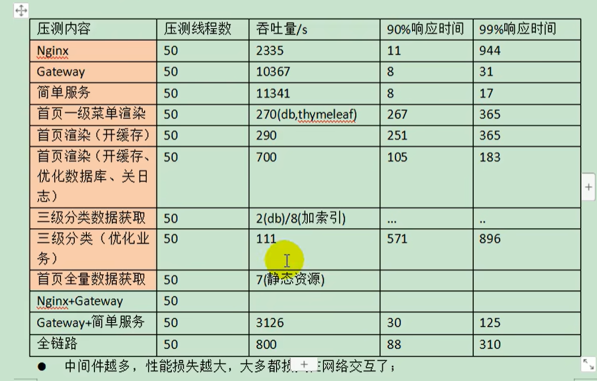
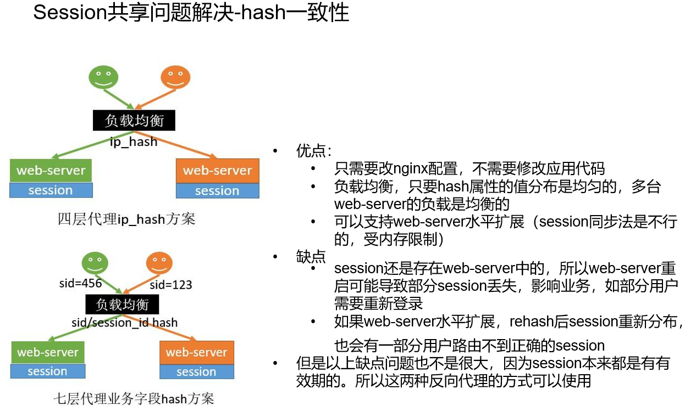
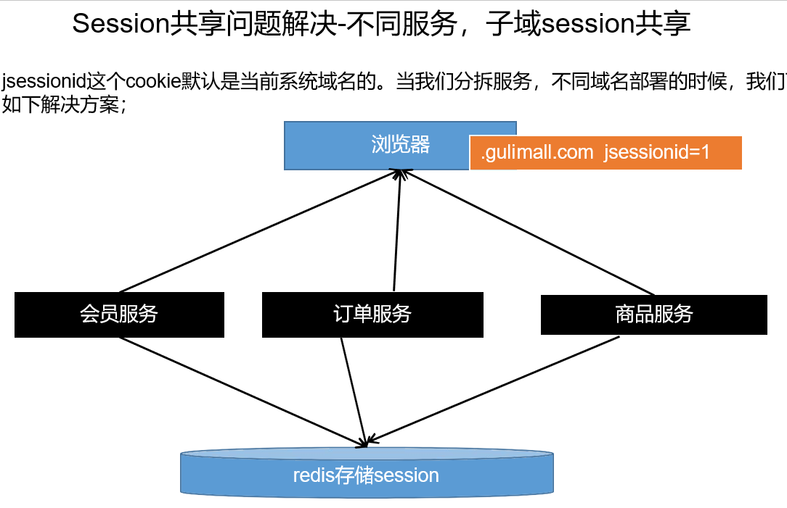
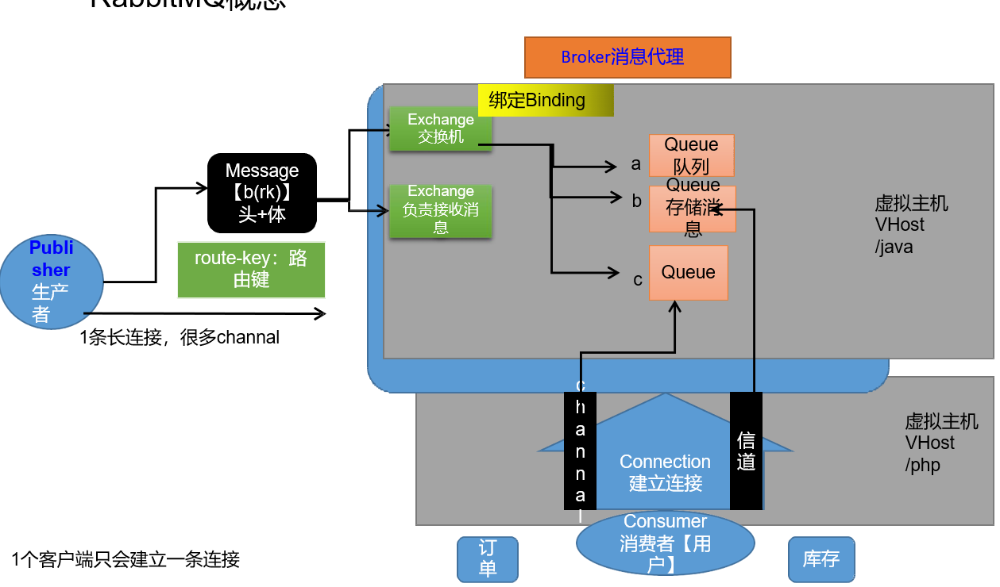
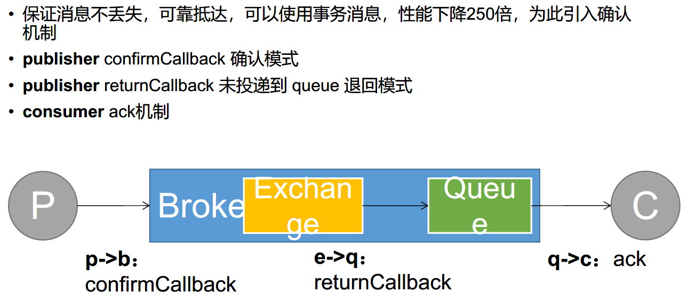
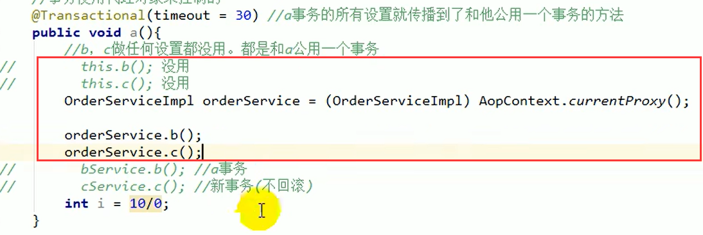
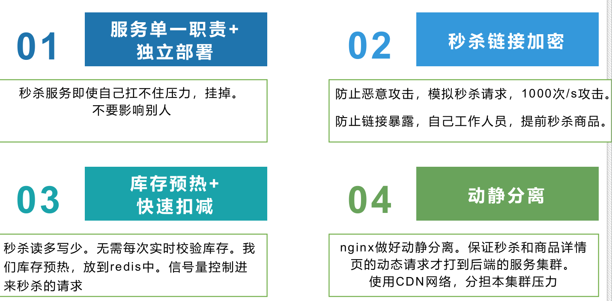
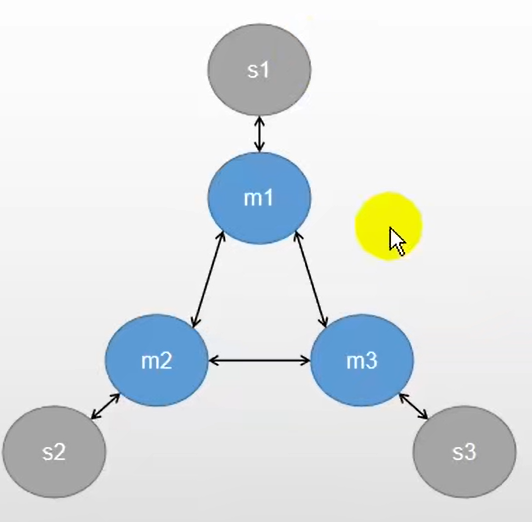
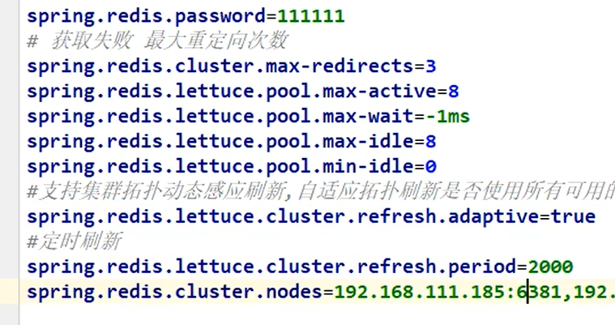

# 谷粒商城

## 压力测试

JMeter

### 监控工具

jconsole 和 jvisualvm

## 测试结果



## 缓存

### Spring boot  Redis 缓存的坑

    //TODO 产生堆外内存溢出OutOfDirectMemoryError:
    //1)、springboot2.0以后默认使用lettuce操作redis的客户端，它使用通信
    //2)、lettuce的bug导致netty堆外内存溢出   可设置：-Dio.netty.maxDirectMemory
    //解决方案：不能直接使用-Dio.netty.maxDirectMemory去调大堆外内存
    //1)、升级lettuce客户端。      2）、切换使用jedis
### 缓存数据一致性解决方案


## 分布式锁

### Redison

网址

https://github.com/redisson/redisson/wiki/8.-distributed-locks-and-synchronizers

### 可重入锁

A方法获取锁，调用B，B默认也拥有该锁

### 公平锁

按时间分配

### 读锁

### 写锁

### 信号量

首先有默认值

申请

```
RSemaphore park = redisson.getSemaphore("park");
park.acquire();     //获取一个信号、获取一个值,占一个车位
boolean flag = park.tryAcquire();
```

释放

```
RSemaphore park = redisson.getSemaphore("park");
park.release();     //释放一个车位
```

### 闭锁

```
RCountDownLatch door = redisson.getCountDownLatch("door");
door.trySetCount(5);
door.await();       //等待闭锁完成
```

```
    RCountDownLatch door = redisson.getCountDownLatch("door");
    door.countDown();       //计数-1
```

## Spring-Cache

集成了各种缓存

     * 4、Spring-Cache的不足之处：
     *  1）、读模式
     *      缓存穿透：查询一个null数据。解决方案：缓存空数据
     *      缓存击穿：大量并发进来同时查询一个正好过期的数据。解决方案：加锁 ? 默认是无加锁的;使用sync = true来解决击穿问题
     *      缓存雪崩：大量的key同时过期。解决：加随机时间。加上过期时间
     *  2)、写模式：（缓存与数据库一致）
     *      1）、读写加锁。
     *      2）、引入Canal,感知到MySQL的更新去更新Redis
     *      3）、读多写多，直接去数据库查询就行
     *
     *  总结：
     *      常规数据（读多写少，即时性，一致性要求不高的数据，完全可以使用Spring-Cache）：写模式(只要缓存的数据有过期时间就足够了)
     *      特殊数据：特殊设计
     *
     *  原理：
     *      CacheManager(RedisCacheManager)->Cache(RedisCache)->Cache负责缓存的读写
## 异步与线程

### 线程创建的方式

1）、继承Thread
2）、实现Runnable 接口
3）、实现Callable 接口（实现call）+ FutureTask （可以拿到返回结果，可以处理异常）
4）、线程池

```java
public static ExecutorService executor = Executors.newFixedThreadPool(10);

public static void main(String[] args) throws ExecutionException, InterruptedException {
    // System.out.println("main......start.....");
    // Thread thread = new Thread01();
    // thread.start();
    // System.out.println("main......end.....");

    // Runable01 runable01 = new Runable01();
    // new Thread(runable01).start();

    // FutureTask<Integer> futureTask = new FutureTask<>(new Callable01());
    // new Thread(futureTask).start();
    // System.out.println(futureTask.get());

    // service.execute(new Runable01());
    // Future<Integer> submit = service.submit(new Callable01());
    // submit.get();

    System.out.println("main......start.....");
    // CompletableFuture<Void> future = CompletableFuture.runAsync(() -> {
    //     System.out.println("当前线程：" + Thread.currentThread().getId());
    //     int i = 10 / 2;
    //     System.out.println("运行结果：" + i);
    // }, executor);
```
### 线程池

核心线程数，最大线程数，存活时间、时间单位、阻塞队列、线程工厂、拒绝策略

        new ThreadPoolExecutor(corePoolSize, maximumPoolSize, keepAliveTime, TimeUnit unit,workQueue, threadFactory, handler);
        ExecutorService threadPool = new ThreadPoolExecutor(
                5,
                10,
                10L,
                TimeUnit.SECONDS,
                new LinkedBlockingDeque<Runnable>(10000),
                Executors.defaultThreadFactory(),
                new ThreadPoolExecutor.AbortPolicy()
        );
        //定时任务的线程池
        ExecutorService service = Executors.newScheduledThreadPool(2);
一个线程池core 7；max 20 ，queue：50，100 并发进来怎么分配的；
先有7 个能直接得到执行，接下来50 个进入队列排队，在多开13 个继续执行。现在70 个被安排上了。剩下30 个默认拒绝策略。

#### 常见的4 种线程池

```
Executors.newCachedThreadPool
Executors.newFixedThreadPool
Executors.newScheduledThreadPool
Executors.newSingleThreadExecutor
```

##### newCachedThreadPool

创建一个可缓存线程池，如果线程池长度超过处理需要，可灵活回收空闲线程，若无可回收，则新建线程。

##### newFixedThreadPool

创建一个定长线程池，可控制线程最大并发数，超出的线程会在队列中等待。

##### newScheduledThreadPool

创建一个定长线程池，支持定时及周期性任务执行。

##### newSingleThreadExecutor

创建一个单线程化的线程池，它只会用唯一的工作线程来执行任务，保证所有任务按照指定顺序(FIFO, LIFO, 优先级)执行。

### 异步编排

#### 创建异步对象


#### 计算完成时回调方法

        /**
         * 方法完成后的处理
         */
        // CompletableFuture<Integer> future = CompletableFuture.supplyAsync(() -> {
        //     System.out.println("当前线程：" + Thread.currentThread().getId());
        //     int i = 10 / 0;
        //     System.out.println("运行结果：" + i);
        //     return i;
        // }, executor).whenComplete((res,exception) -> {
        //     //虽然能得到异常信息，但是没法修改返回数据
        //     System.out.println("异步任务成功完成了...结果是：" + res + "异常是：" + exception);
        // }).exceptionally(throwable -> {
        //     //可以感知异常，同时返回默认值
        //     return 10;
        // });
#### handle 方法

        /**
         * 方法执行完后端处理
         */
        // CompletableFuture<Integer> future = CompletableFuture.supplyAsync(() -> {
        //     System.out.println("当前线程：" + Thread.currentThread().getId());
        //     int i = 10 / 2;
        //     System.out.println("运行结果：" + i);
        //     return i;
        // }, executor).handle((result,thr) -> {
        //     if (result != null) {
        //         return result * 2;
        //     }
        //     if (thr != null) {
        //         System.out.println("异步任务成功完成了...结果是：" + result + "异常是：" + thr);
        //         return 0;
        //     }
        //     return 0;
        // });
#### 线程串行化方法


        /**
         * 线程串行化
         * 1、thenRunL：不能获取上一步的执行结果
         * 2、thenAcceptAsync：能接受上一步结果，但是无返回值
         * 3、thenApplyAsync：能接受上一步结果，有返回值
         *
         */
        CompletableFuture<String> future = CompletableFuture.supplyAsync(() -> {
            System.out.println("当前线程：" + Thread.currentThread().getId());
            int i = 10 / 2;
            System.out.println("运行结果：" + i);
            return i;
        }, executor).thenApplyAsync(res -> {
            System.out.println("任务2启动了..." + res);
            return "Hello" + res;
        }, executor);
        System.out.println("main......end....." + future.get());
#### 两任务组合- 都要完成

#### 两任务组合- 一个完成

#### 多任务组合


### 代码异步编排

```java
    @Resource
    private ThreadPoolExecutor executor;
	@Override
    public SkuItemVo item(Long skuId) throws ExecutionException, InterruptedException {

        SkuItemVo skuItemVo = new SkuItemVo();

        CompletableFuture<SkuInfoEntity> infoFuture = CompletableFuture.supplyAsync(() -> {
            //1、sku基本信息的获取  pms_sku_info
            SkuInfoEntity info = this.getById(skuId);
            skuItemVo.setInfo(info);
            return info;
        }, executor);

        CompletableFuture<Void> saleAttrFuture = infoFuture.thenAcceptAsync((res) -> {
            //3、获取spu的销售属性组合
            List<SkuItemSaleAttrVo> saleAttrVos = skuSaleAttrValueService.getSaleAttrBySpuId(res.getSpuId());
            skuItemVo.setSaleAttr(saleAttrVos);
        }, executor);

        CompletableFuture<Void> descFuture = infoFuture.thenAcceptAsync((res) -> {
            //4、获取spu的介绍    pms_spu_info_desc
            SpuInfoDescEntity spuInfoDescEntity = spuInfoDescService.getById(res.getSpuId());
            skuItemVo.setDesc(spuInfoDescEntity);
        }, executor);

        CompletableFuture<Void> baseAttrFuture = infoFuture.thenAcceptAsync((res) -> {
            //5、获取spu的规格参数信息
            List<SpuItemAttrGroupVo> attrGroupVos = attrGroupService.getAttrGroupWithAttrsBySpuId(res.getSpuId(), res.getCatalogId());
            skuItemVo.setGroupAttrs(attrGroupVos);
        }, executor);

        // Long spuId = info.getSpuId();
        // Long catalogId = info.getCatalogId();

        //2、sku的图片信息    pms_sku_images
        CompletableFuture<Void> imageFuture = CompletableFuture.runAsync(() -> {
            List<SkuImagesEntity> imagesEntities = skuImagesService.getImagesBySkuId(skuId);
            skuItemVo.setImages(imagesEntities);
        }, executor);

        CompletableFuture<Void> seckillFuture = CompletableFuture.runAsync(() -> {
            //3、远程调用查询当前sku是否参与秒杀优惠活动
            R skuSeckilInfo = seckillFeignService.getSkuSeckilInfo(skuId);
            if (skuSeckilInfo.getCode() == 0) {
                //查询成功
                SeckillSkuVo seckilInfoData = skuSeckilInfo.getData("data", new TypeReference<SeckillSkuVo>() {
                });
                skuItemVo.setSeckillSkuVo(seckilInfoData);

                if (seckilInfoData != null) {
                    long currentTime = System.currentTimeMillis();
                    if (currentTime > seckilInfoData.getEndTime()) {
                        skuItemVo.setSeckillSkuVo(null);
                    }
                }
            }
        }, executor);
        //等到所有任务都完成
        CompletableFuture.allOf(saleAttrFuture,descFuture,baseAttrFuture,imageFuture,seckillFuture).get();

        return skuItemVo;
    }
```

## SpringSession

使用装饰者模式包装原本session

### session同步解决方案





## 消息队列（MQ）

### 作用与应用

异步处理、应用解耦、流量控制

### 两个重要概念

消息代理（message broker）和目的地（destination）
当消息发送者发送消息以后，将由消息代理接管，消息代理保证消息传递到指定目的地

### 消息队列主要有两种形式的目的地

1. 队列（queue）：点对点消息通信（point-to-point）
2. 主题（topic）：发布（publish）/订阅（subscribe）消息通信

### rabbitMQ 架构模型




### RabbitMQ消息确认机制



### 在springboot中的使用

只要在spring中有相关bean 如 exchange ，springboot只要连接上mq，spring会自动在mq中创建

## 接口幂等性

### 令牌机制

### 各种锁

### 防重表

## 本地事务

### 事务的基本性质

ACID

### 事务的隔离级别

READ UNCOMMITTED（读未提交）
READ COMMITTED（读提交）
REPEATABLE READ（可重复读） 读的时候加读锁
SERIALIZABLE（序列化）单任务模式

### 事务的传播行为

（A事务 的过程中去调B事务）

PROPAGATION_REQUIRED

PROPAGATION_REQUIRES_NEW

### Spring Boot 事务的坑

在同一个类里面，编写两个方法，内部调用的时候，会导致事务设置失效（传播行为失效）。原因是没有用到代理对象的缘故。
解决：
0）、导入spring-boot-starter-aop
1）、@EnableTransactionManagement(proxyTargetClass = true)
2）、@EnableAspectJAutoProxy(exposeProxy=true)
3）、AopContext.currentProxy() 调用方法



## 分布式事务

### 解决方案

#### 二阶段提交（seata使用）

不适应高并发

主要分为两个阶段：准备、提交

#### 柔性事务-TCC 模式

不适应高并发

主要将代码分为：

try   业务代码

confirm   提交代码

cancel	回滚代码

### 柔性事务-最大努力通知型方案

支付宝支付，异步通知

### 柔性事务-可靠消息+最终一致性方案（异步确保型）

使用mq异步通知，

延迟队列

#### 消息的丢失、重复、积压

丢失使用确认机制、或数据库表记录

重复使用接口幂等性

积压、增加消费者

## seata （分布式事务）

网址：https://seata.io/zh-cn/

### 基本概念

TC (Transaction Coordinator) - 事务协调者
维护全局和分支事务的状态，驱动全局事务提交或回滚。

TM (Transaction Manager) - 事务管理器
定义全局事务的范围：开始全局事务、提交或回滚全局事务。

RM (Resource Manager) - 资源管理器 （小事务管理器）
管理分支事务处理的资源，与TC交谈以注册分支事务和报告分支事务的状态，并驱动分支事务提交或回滚。

### 使用

```
* Seata控制分布式事务
*  1）、每一个微服务必须创建undo_Log
*  2）、安装事务协调器：seate-server
*  3）、整合
*      1、导入依赖
*      2、解压并启动seata-server：
*          registry.conf:注册中心配置    修改 registry ： nacos
*      3、所有想要用到分布式事务的微服务使用seata DataSourceProxy 代理自己的数据源
*      4、每个微服务，都必须导入   registry.conf   file.conf
*          vgroup_mapping.{application.name}-fescar-server-group = "default"
*      5、启动测试分布式事务
*      6、给分布式大事务的入口标注@GlobalTransactional
*      7、每一个远程的小事务用@Trabsactional
*/
```

## 支付

### 非对称加密

RSA2

### 沙箱测试

### 内网穿透

natapp：https://natapp.cn/ 
续断：www.zhexi.tech
花生壳：https://www.oray.com/

## 定时任务

```
/**
 * 1、在Spring中表达式是6位组成，不允许第七位的年份
 * 2、在周几的的位置,1-7代表周一到周日
 * 3、定时任务不该阻塞。默认是阻塞的
 *      1）、可以让业务以异步的方式，自己提交到线程池
 *              CompletableFuture.runAsync(() -> {
 *         },execute);
 *
 *      2）、支持定时任务线程池；设置 TaskSchedulingProperties
 *        spring.task.scheduling.pool.size: 5
 *
 *      3）、让定时任务异步执行
 *          异步任务
 *
 *      解决：使用异步任务 + 定时任务来完成定时任务不阻塞的功能
 *
 */
// @Async
// @Scheduled(cron = "*/5 * * ? * 4")
// public void hello() {
//     log.info("hello...");
//     try { TimeUnit.SECONDS.sleep(3); } catch (InterruptedException e) { e.printStackTrace(); }
//
// }
```

## 并发量计算

一个方法单线程50mm（加网络），一秒钟20个并发，Tomcat 500，总并发10000 

## 秒杀业务




## sentinel 流量控制

Sentinel 可以简单的分为 Sentinel 核心库和 Dashboard。核心库不依赖 Dashboard，但是结合 Dashboard 可以取得最好的效果。

Dashboard：需要下载运行

网址 https://sentinelguard.io/zh-cn/docs/basic-api-resource-rule.html

### 无需代码自动控制

引入相关依赖后，在控制面板即可对请求过得接口进行控制

### 异常处理方式

### 方法注解方式

## sleuth 链路跟踪

引入依赖即可

### 基本概念

#### span

每一个远程调用成为span，span和span之间有父子关系

每个span包括以下时间节点

cs、cr

ss、sr

#### trace

一整个链路成为trace

### zipkin 图形化界面

需要下载


可以查看完整调用链路，是否异步，


## Redis集群

### 客户端分区

### 代理分区

### redis-cluster

都是使用一个散列环将数据分散在不同的节点上

#### 槽

#### 一致性hash

#### 使用（三主三从）



Java中增加配置即可



## ElasticSearch 集群

**主节点** 负责创建索引、删除索引、分配分片、追踪集群中的节点状态等工作。Elasticsearch中的主节点的工作量相对较轻，用户的请求可以发往集群中任何一个节点，由该节点负责分发和返回结果，而不需要经过主节点转发。

### 健康状态

green 、yellow、red  （单节点为黄色）

### 分片

创建索引时可以指定分片，默认是主分片1，副本分片1

### 集群配置

多个拥有相同cluster.name 配置的节点组成

### 使用（三主三数据）


## RabbitMQ 集群

### 普通模式

集群之间只复制元数据，即交换机、队列等数据

### 镜像模式


