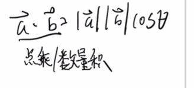
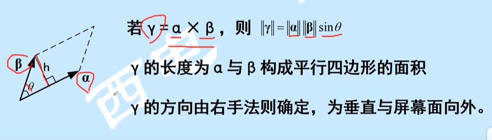
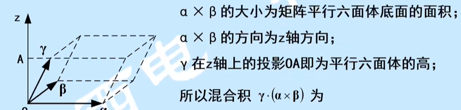
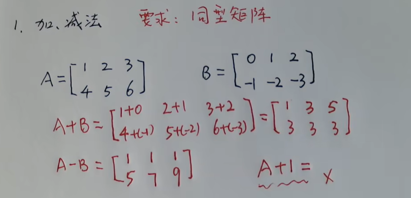
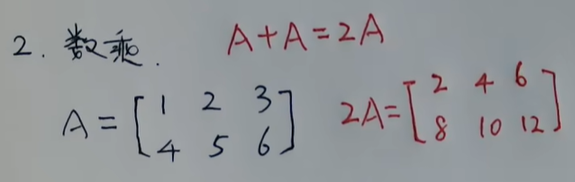
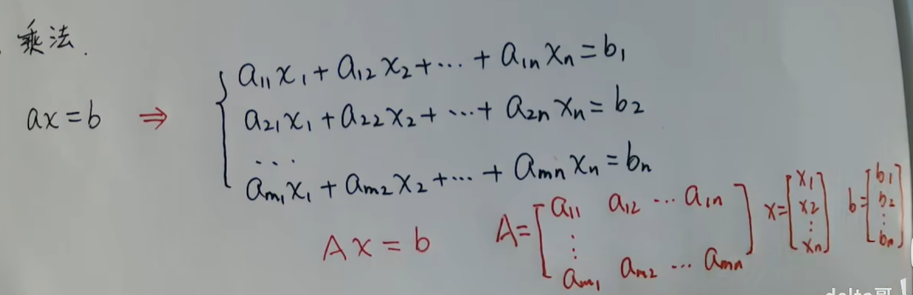
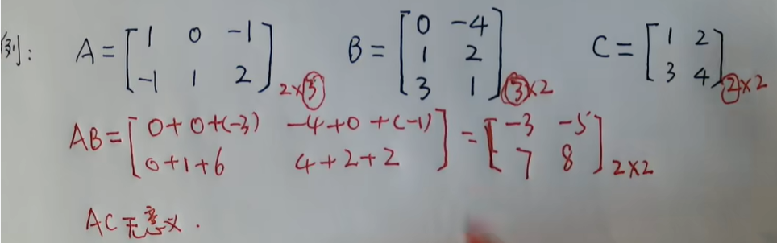
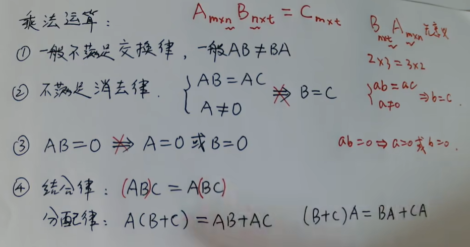
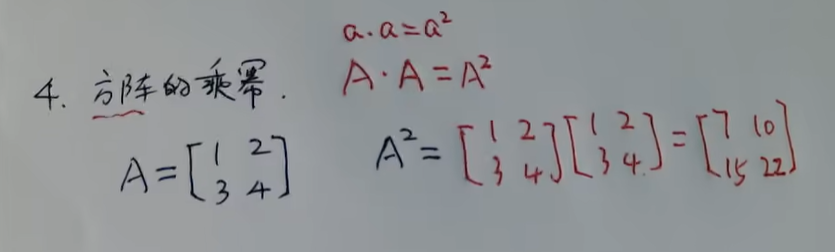
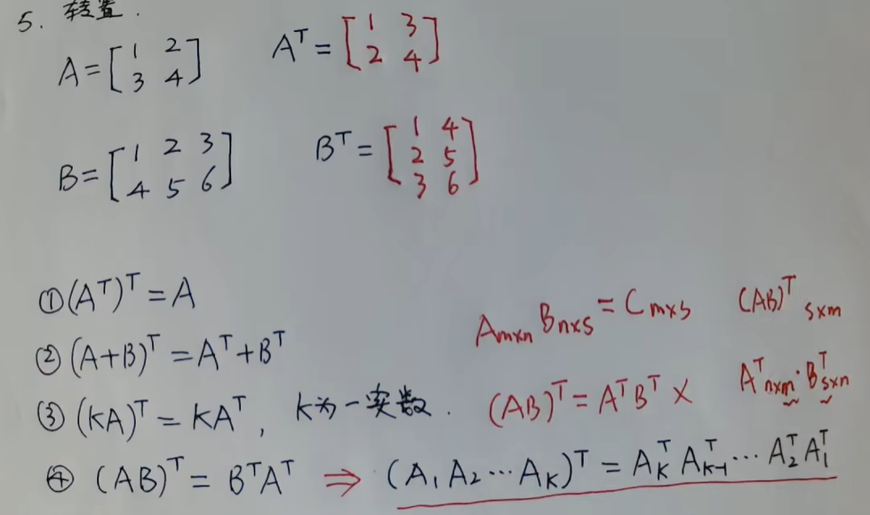

偏导数

其他未知数，都是已知数，来求导。

# 向量运算

## 向量加法

三角形法则

平行四边形法则

## 向量减法

加一个反向量

## 向量的数乘

一个向量乘以一个数字

## 向量内积（点乘）

由物理中 W=FS 引出，结果不是向量是一个常数

## 向量叉乘

由电磁学中 洛伦兹力引出，向量乘向量结果是一个新的向量，方向垂直于原始向量构成的平面，大小等于这两个向量构成的平行四边形的面积。 遵循右手法则

## 向量混合积

# 矩阵运算

## 加减法

## 数乘

## 乘法

运算时**行乘列**

线性方程组简写

### 示例

### 运算

## 方阵的乘幂

方阵 行列相当

## 转置

# 使用矩阵计算向量

是的，向量可以用矩阵的方式进行运算。在线性代数中，向量可以被视为一个列矩阵（或行矩阵），而向量之间的加法、数乘、点乘等运算可以通过矩阵运算来表示和计算。

以下是一些常见的向量运算与矩阵的对应关系：

1. **向量加法**：两个向量相加的操作可以通过矩阵的加法来表示。例如，对于向量$\mathbf{a} = \begin{bmatrix} a_1 \\ a_2 \\ \vdots \\ a_n \end{bmatrix}$和$\mathbf{b} = \begin{bmatrix} b_1 \\ b_2 \\ \vdots \\ b_n \end{bmatrix}$，它们的和可以表示为$\mathbf{a} + \mathbf{b} = \begin{bmatrix} a_1 + b_1 \\ a_2 + b_2 \\ \vdots \\ a_n + b_n \end{bmatrix}$。

2. **数乘**：向量与标量的乘法（数乘）可以通过矩阵的标量乘法来表示。例如，对于向量$\mathbf{a} = \begin{bmatrix} a_1 \\ a_2 \\ \vdots \\ a_n \end{bmatrix}$和标量$k$，它们的数乘可以表示为$k\mathbf{a} = \begin{bmatrix} ka_1 \\ ka_2 \\ \vdots \\ ka_n \end{bmatrix}$。

3. **点乘**：向量的点乘（内积）可以通过矩阵的转置和乘法来表示。例如，对于向量$\mathbf{a} = \begin{bmatrix} a_1 \\ a_2 \\ \vdots \\ a_n \end{bmatrix}$和$\mathbf{b} = \begin{bmatrix} b_1 \\ b_2 \\ \vdots \\ b_n \end{bmatrix}$，它们的点乘可以表示为$\mathbf{a}^T\mathbf{b} = a_1b_1 + a_2b_2 + \ldots + a_nb_n$。

4. **叉乘**：对于三维向量，叉乘可以通过矩阵的行列式和逆矩阵来表示。例如，对于三维向量$\mathbf{a} = \begin{bmatrix} a_1 \\ a_2 \\ a_3 \end{bmatrix}$和$\mathbf{b} = \begin{bmatrix} b_1 \\ b_2 \\ b_3 \end{bmatrix}$，它们的叉乘可以表示为$\mathbf{a} \times \mathbf{b} = \begin{vmatrix} \mathbf{i} & \mathbf{j} & \mathbf{k} \\ a_1 & a_2 & a_3 \\ b_1 & b_2 & b_3 \end{vmatrix}$。

通过将向量表示为列矩阵或行矩阵，并利用矩阵的运算规则，我们可以方便地进行向量之间的各种运算。这种矩阵表示方式在计算机图形学、机器学习、物理学等领域中有着广泛的应用。如果你有任何关于向量与矩阵运算的具体问题或需要更详细的解释，请随时告诉我。

# 线性回归

## 一元线性回归

一元线性回归是一种用于建立自变量（x）与因变量（y）之间线性关系的统计模型。其数学表达式可以表示为简单的直线方程：

$$
y = mx + b
$$

其中，y 是因变量（要预测的值），x 是自变量（已知的输入值），m 是直线的斜率，b 是直线的截距。在一元线性回归中，我们的目标是找到最佳拟合直线，使得预测值 y 与实际观测值之间的误差最小化。

一元线性回归的求解通常通过最小二乘法来实现。最小二乘法的目标是最小化实际观测值与拟合值之间的残差平方和。具体步骤如下：

1. 计算自变量 x 和因变量 y 的均值：$\bar{x}$ 和 $\bar{y}$。
2. 计算斜率 m 的估计值：

$$
m = \frac{\sum_{i=1}^{n} (x_i - \bar{x})(y_i - \bar{y})}{\sum_{i=1}^{n} (x_i - \bar{x})^2}
$$

3. 计算截距 b 的估计值：

$$
b = \bar{y} - m\bar{x}
$$

4. 得到最终的回归方程：$y = mx + b$。

