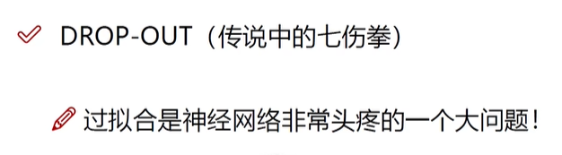

# 图片再计算机中的表示

一个图片可以用数组来表示，通常使用的是三维数组，分别表示图片的高度、宽度和颜色通道。在计算机视觉领域中，常用的表示方式是将图片表示为一个三维的矩阵，其中每个元素代表一个像素的数值。

例如，对于一张彩色图片，可以表示为一个三维数组，形状为（高度，宽度，3），其中3代表红、绿、蓝（RGB）三个颜色通道。每个像素点包含三个数值，分别表示红、绿、蓝三个通道的亮度值，取值范围通常是0到255。

下面是一个简单的示例，假设有一张2x2的彩色图片，可以用一个3维数组表示：

```python
[
  [[255, 0, 0], [0, 255, 0]],
  [[0, 0, 255], [255, 255, 0]]
]
```

# 深度学习解决的问题

## 机器学习流程


1. **特征工程**：选择和提取对模型预测有意义的特征，包括特征选择、特征变换、特征构建等操作。

## 解决问题

减少了机器学习中的特征提取

# 损失函数

## 正则化

在机器学习中，正则化是一种用于控制模型复杂度并防止过拟合的技术。正则化通过在模型训练过程中增加额外的惩罚项来限制模型参数的大小，从而降低模型的复杂度。正则化的目的是在保持模型在训练数据上表现良好的同时，提高模型在未见数据上的泛化能力。

## 损失函数


## 回归任务

由得分值计算损失

## 分类任务

由概率值计算损失

# 逆向传播

## 梯度

梯度是指函数在某一点的变化率或斜率

## 链式法则

梯度是一步一步传的

w权重是逐层从后向前计算的

## 门单元

梯度从后向前传递时如何分配


# 神经网络整体结构


## 非线性方程


## 激活函数


sigmoid会带来梯度消失的现象，常使用 relu

## 权重初始化


## drop out



每次只训练网络中的部分节点

# 传统神经网络存在的问题

参数特别多，不好训练，训练比较慢，过拟合风险很高

# 神经网络模型分类

在神经网络领域，有许多不同的网络模型，每种模型都有其独特的结构和用途。以下是一些常见的神经网络模型：

1. 多层感知机（Multilayer Perceptron, MLP）：是最简单的前馈神经网络，由多个全连接的隐藏层组成。
2. 卷积神经网络（Convolutional Neural Network, CNN）：主要用于图像识别和计算机视觉任务，具有卷积层和池化层。
3. 循环神经网络（Recurrent Neural Network, RNN）：适用于序列数据，具有循环连接的结构，可以捕捉序列中的时间依赖关系。
4. 长短时记忆网络（Long Short-Term Memory, LSTM）：一种特殊的RNN结构，能够更好地处理长序列数据和解决梯度消失问题。
5. 门控循环单元（Gated Recurrent Unit, GRU）：与LSTM类似，也是一种用于处理序列数据的RNN结构，但参数更少，计算效率更高。
6. 自动编码器（Autoencoder）：用于无监督学习的神经网络模型，可以学习数据的压缩表示。
7. 生成对抗网络（Generative Adversarial Network, GAN）：由生成器和判别器组成的对抗性模型，用于生成逼真的数据样本。
8. 深度信念网络（Deep Belief Network, DBN）：由多个受限玻尔兹曼机堆叠而成的深度神经网络，用于特征学习和无监督预训练。

# 神经网络框架

神经网络框架是用于构建、训练和部署神经网络模型的工具库，提供了各种功能和接口来简化神经网络的开发过程。以下是一些常用的神经网络框架：

1. **TensorFlow**：由Google开发的开源深度学习框架，提供了灵活的图计算和自动微分功能，支持动态图和静态图两种模式。

2. **PyTorch**：由Facebook开发的深度学习框架，提供了易用的动态图机制，更符合Python编程习惯，广受深度学习研究者和开发者喜爱。

3. **Keras**：基于Python编写的高级神经网络API，可以在TensorFlow、Theano和CNTK等后端框架上运行，易学易用，适合快速搭建神经网络模型。

4. **MXNet**：由亚马逊开发的深度学习框架，支持动态图和静态图混合编程，性能优秀，适合在分布式环境中进行训练。

5. **Caffe**：由伯克利视觉与学习中心（BVLC）开发的深度学习框架，主要用于图像识别任务，具有速度快、易于部署等特点。

6. **Theano**：由蒙特利尔大学开发的深度学习框架，提供了符号计算功能，已停止更新，但仍在一些项目中使用。

7. **CNTK**（Microsoft Cognitive Toolkit）：由微软开发的深度学习框架，具有高效的性能和可扩展性，适合在大规模数据集上进行训练。


# 卷积神经网络（CNN）

CNN主要用于计算机视觉

## 数学概念

### 内积

矩阵中对应位置相乘，得到的值加一块

## 整体架构


## 卷积层

### 过程


### 卷积参数


### 计算


## 池化层


## 整体过程


## 具体实现

### vgg

超过16层之后，学习效果有下降的趋势。

### resnet

可以跳过网络中的部分节点（权重W为0），改善了vgg 的问题。


# 自然语言处理

## 递归神经网络（RNN）


## 长短时记忆网络（Long Short-Term Memory, LSTM）


## 词向量

将一个词转为一个50-300维的向量

### Word2Vec

Word2Vec是一种用于将单词表示为向量的技术，它是由Google的Tomas Mikolov等人于2013年提出的。Word2Vec的主要思想是通过训练一个神经网络模型，将单词映射到一个高维空间中的稠密向量，使得具有相似语义的单词在向量空间中距离较近。


逆向传播的时候也会对词向量进行更新


