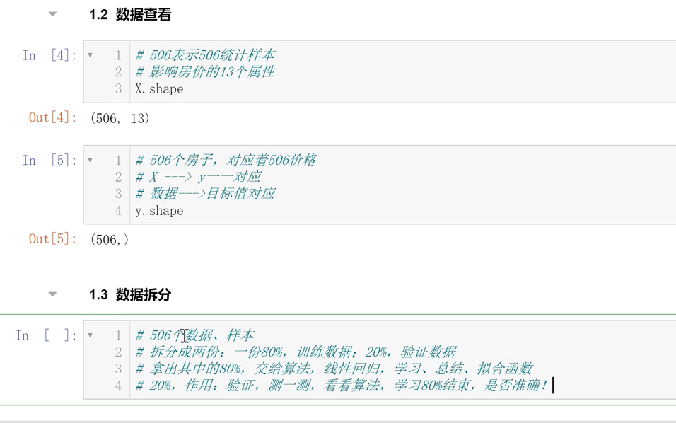
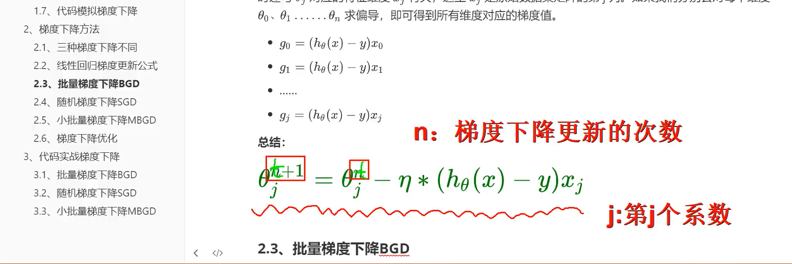

# 线性回归

## 损失函数

在机器学习和深度学习中，损失函数（Loss Function）是用来衡量模型预测结果与真实标签之间的差异或损失程度的函数。损失函数的设计旨在帮助优化算法调整模型参数，使其能够更好地拟合训练数据并提高预测性能。

## 梯度下降

### 梯度下降的优化

#### 归一化

归一化（Normalization）是数据预处理的一种重要技术，旨在**将数据缩放到特定的范围或分**布，以便更好地适应模型的训练和提高算法的性能。归一化的主要目的是消除数据之间的量纲差异，使不同特征之间具有可比性，避免某些特征对模型训练产生过大的影响

归一化，可以减少下降次数

## 收敛

每次减少步长，也是学习率

# 逻辑回归

是一种分类算法，分类模型，常用 sigmoid函数

多分类算法 softmax

# SVM 支持向量机

支持向量机（Support Vector Machine，SVM）是一种常用的监督学习算法，主要用于分类和回归任务。SVM的目标是找到一个最优的超平面，将不同类别的数据点有效地分开，并且使得边界到最近的数据点的距离最大化。

# 数据升维、数据降维