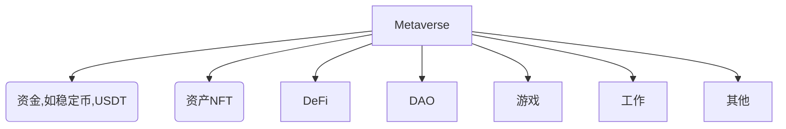

# Metaverse

**问题：**既然合约可以搬到区块链上，那宇宙是否可以搬到区块链上？

元宇宙是**以区块链和web3.0为核心**的世界虚拟化产物。具有前进性（不可回退性或不可更改性）、去中心化、公开性。自成一个世界，**形成一个完整的系统闭环**。

元宇宙包括资金的虚拟化（稳定币，USDT），资产NFT（Non-Fungible Token）化，金融交易DeFi化（Decentralized Finance），组织DAO化（Decentralized Autonomous Organization），娱乐游戏化，工作远程化，其他

**涵盖：资金、资产、金融、组织、娱乐、工作、等**

