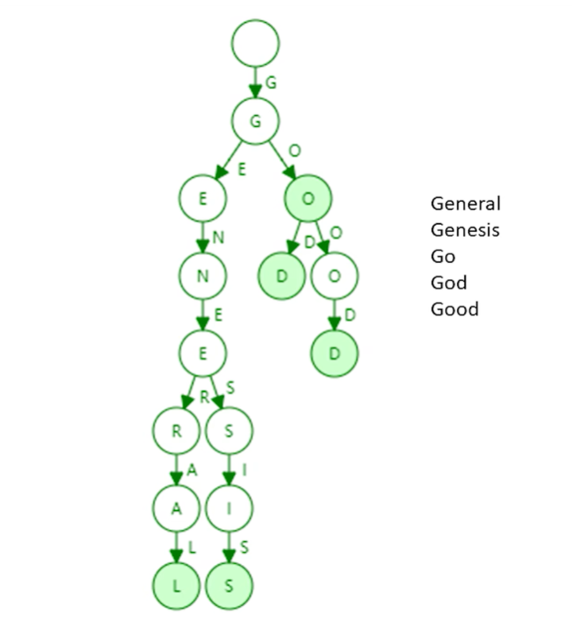
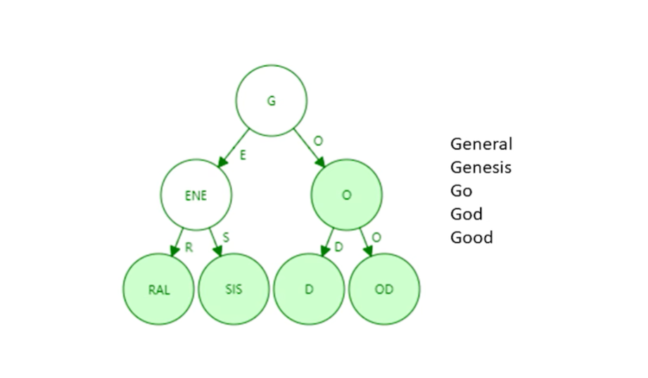
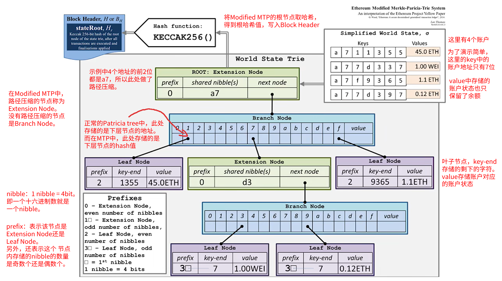

# 北京大学 区块链技术与应用 主要内容

概述：基于账户的分布式账本

数据结构：状态树、交易树、收据树

ghost协议

挖矿：memory-hard mining puzzle

挖矿难度调整

权益证明 casper the Friendly Finality Gadget

智能合约

总结与展望

# 概述

以太坊在设计上针对比特币出现的一些问题进行了改进，例如：

- 出块时间：比特币的出块时间为10分钟，以太坊降低到了十几秒

- 挖矿使用的 mining puzzle：比特币的mining puzzle是计算密集型，比拼的是计算哈希的算力，最终造成了挖矿设备的专业化，从原始的CPU变成了专业的ASIC芯片。**以太坊设计的mining puzzle对内存需求比较高（memory hard mining puzzle）**，这样在一定程度上限值了ASIC芯片的使用（ASIC resistance）。

# ETH账户

以太坊采用的是基于账户的账本模型（account-based ledger）。

以太坊中有两类账户：

- 外部账户

- 合约账户

## 外部账户

外部账户（externally owned account）类似比特币中的账户，本地产生一个公私钥对，利用私钥进行控制。有时也称为普通账户。

外部账户的状态有：

**余额（balance）、交易次数（nonce）。**

## 合约账户

合约账户（smart contract account）不是由私钥进行控制的。

合约账户不能主动发起交易，所有的交易只能有外部账户发起。外部账户发起一个交易，如果调用了一个合约账户，这个合约账户可以再调用另一个合约账户，这样是可以的，但是它不能自己平白的发起一个交易。

**合约账户除了具有余额（balance）、交易次数（nonce）之外，还有代码（code）、存储（storage）。**

在创建合约时会返回一个地址，知道这个合约的地址就可以调用这个合约，调用的过程中合约账户的storage会发生变化。

# ETH状态树

## trie tree

## Patricia tree

Patricia tree（也称为 patricia trie），就是经过了路径压缩的 trie tree，所以也称“压缩前缀树”。

例如上面例子中的trie tree，经过路径压缩后，变为以下样子：

## MPT

MPT：即Merkler Patricia tree。

把所有的账户组合成一个trie tree，通过路径压缩变为 Patricia tree，然后将指针换成哈希指针，变成 Merkle Patricia tree。最后可以计算出一个根哈希值，写到block header中。

## 以太坊中的MPT

### Modified MPT

以太坊中使用的不是原生的MPT，而是修改后的Modified MPT。

Modified MPT对MPT做了一些修改，但是这些修改不是很本质的修改。

Modified MPT示例：

## MPT中value的存储

状态树中，key保存的是账户的地址，value保存的是序列化后的账户的状态。

账户的状态在保存进MPT树之前，需要先用 RLP 编码进行序列化，然后再进行存储。

RLP（Recursive Length Prefix），是一种序列化方法，特点是极简单。

# ETH交易树和收据树

使用的数据结构也是MPT

## 布隆过滤器

# ETH的GHOST协议

## 以太坊的共识协议

 

以太坊中采用了基于GHOST协议的共识机制。

GHOST协议并不是以太坊发明的，在以太坊出现之前就有已经出现了，以太坊对这个协议做了一些修改。

 

## 以太坊出块奖励 

在比特币系统中，存在出块奖励的减半机制。

在以太坊中，没有出块奖励减半，每个区块的出块奖励是指定好的：

在以太坊初期，一个区块的出块奖励是 5ETH

2017年10月的拜占庭升级，一个区块的出块奖励降到 3ETH

2019年3月的君士坦丁堡升级，一个区块的出块奖励降到 2ETH

## uncle block 

 

GHOST协议的核心是，即使自己挖的区块作废了，也能得到一些出块奖励。被分叉出去的区块，在比特币中成为了orphan block，而在以太坊中叫做 uncle block。

# ETH挖矿算法

 

增强了对内存的使用

## ASIC resistance

 

比特币之后出现的其他货币（包括以太坊），设计mining puzzle的一个目标就是 ASIC resistance。一个常用的做法就是增加算法对内存访问的需求，即memory hard mining puzzle。

# 难度调整

btc每10 分钟出一个区块，ETH每15s 出一个区块。

在ETH挖矿难度中有一个难度炸弹（这个主要是为**让共识机制从工作量证明向权益证明**转移）。

# ETH权益证明

## 共识机制的两种证明方式

### PoW （Proof of Work）

**工作量证明** BTC使用的就是这种方式；

### PoS （Proof of Stake）

**权益证明** 未来ETH要使用；

## Casper

以太坊中准备采用的权益证明为 Casper the Friendly Finality Gadget （Casper FFG），它在过渡阶段也是要和PoW混合使用的。

Finality 是一种最终的状态，包含在Finality 中的交易不会被取消。PoW中单纯基于挖矿的交易是有可能被回滚的，例如通过分叉攻击，原来链上的交易就可能被取消了。

### 两阶段提交

数据库两阶段提交（two-phase commit，2PC）：

- 第一阶段：Prepare Message

- 第二阶段：Commit Message

### epoch

每50个区块作为一个epoch

### Validator

Validator 是权益证明的实现，成为Validator必须缴纳一定的保证金（ETH），Validator 对epoch进行投票，过程类似二阶提交。

Validator 对epoch进行投票，这一轮投票对于上一个epoch来说，是Commit Message，对于下一个epoch是Prepare Message。实际依然是两轮投票都要得到2/3以上的多数才算有效。

# ETH智能合约

 

**智能合约是运行在区块链上的一段代码（合同）**，代码的逻辑定义了合约的内容。

智能合约的账户保存了合约当前的运行状态：

●balance：当前余额

●nonce：交易次数

●code：合约代码

●storage：存储（数据结构是一棵MPT）

## Solidity 

 

Solidity是智能合约最常用的语言，语法上与JavaScript很接近

## EVM

编写了一个智能合约，就类似编写了一个java类。在发布到区块链上时，区块链的每个节点都会在本地的EVM中自动的去将该class实例化出来一个对象，有且只有进行这一次实例化（类似单例模式）。

# TheDao

黑客攻击theDAO事件导致了ETH产生了硬分叉，分为ETH和ETC， 主要原因还是因为The DAO 的合约代码有漏洞。

## DAO

DAO：Decentralized Autonomous Orgnization，去中心化的自治组织。传统的组织建立在章程等法律文件基础上，还需到政府部门注册，而DAO组织建立在代码基础上，组织的规章制度写在代码里，通过区块链的共识协议维持组织的正常运行。

DAC：Decentralized Autonomous Corporation，去中心化的自治公司。DAC在现实中并不具有实际公司应有的法人地位，一般也没有董事长等职务。

TheDAO：一个致力于众筹投资的DAO组织，是一个组织名。该组织用于投资的钱是在区块链里众筹得到的。

# 反思

## 不可篡改性的反思

Nothing is irrevocable，没有什么是真的不可篡改的。

## **语言设计的反思**

# 美链

**美链（Beauty Chain）是一个部署在以太坊上的智能合约，有自己的代币BEC**。

- 没有自己的区块链，代币的发行、转账都是通过调用智能合约中的函数来完成的

- 可以自己定义发行规则，每个账户有多少代币也是保存在智能合约的状态变量里

- ERC 20 是以太坊上发行代币的一个标准，规范了所有发行代币的合约应该实现的功能和遵循的接口

- 美链中有一个叫做 `batchTransfer` 的函数，它的功能是向多个接收者发送代币，然后把这些代币从调用者的账户上扣除

EOS（柚子币）在发行之前，也是以太坊上的一种代币，后来正式发行后，转到了自己的基础链上。

# 总结

BTC 等虚拟币可以很好的用作跨国转账，如果使用现有的金融系统会很慢。

智能合约使用代码编写的，只有程序员才能看懂。

程序化是一个大趋势，Software is eating the world

太多的民主和去中心化并不一定是好事

笔记地址：https://www.yuque.com/tmfl/block_chain/yv8oxh7v83741iaz

# 区块链核心特性

## 公开性

## 不可篡改性