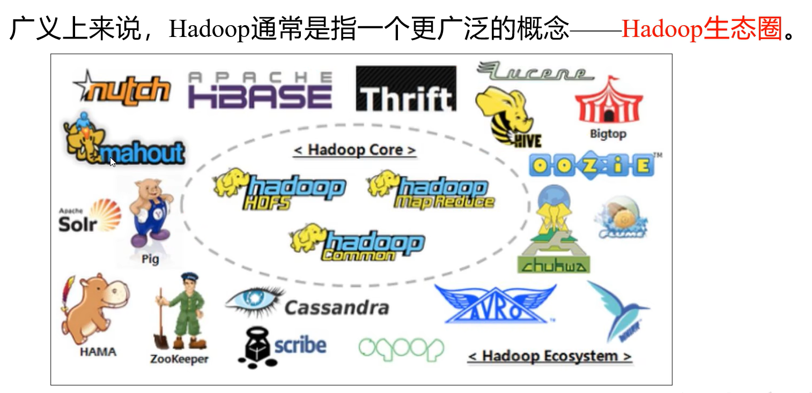
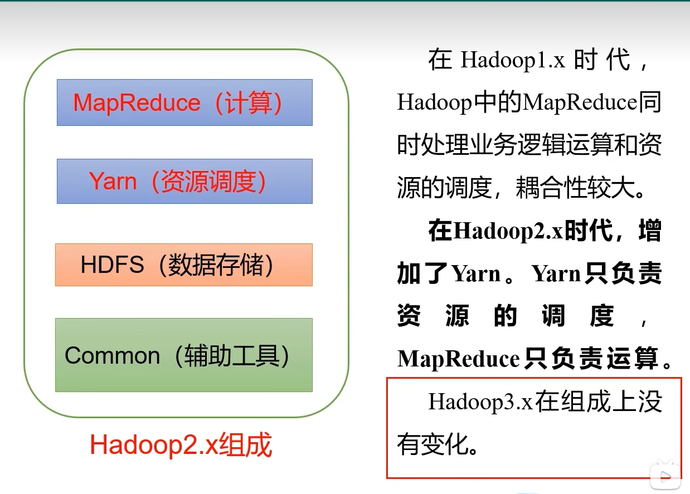
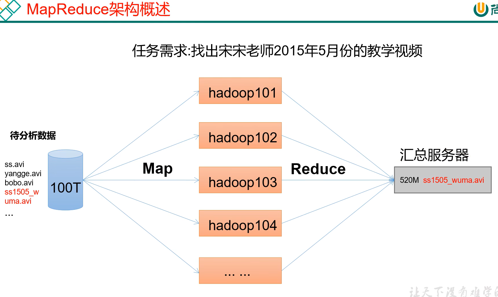
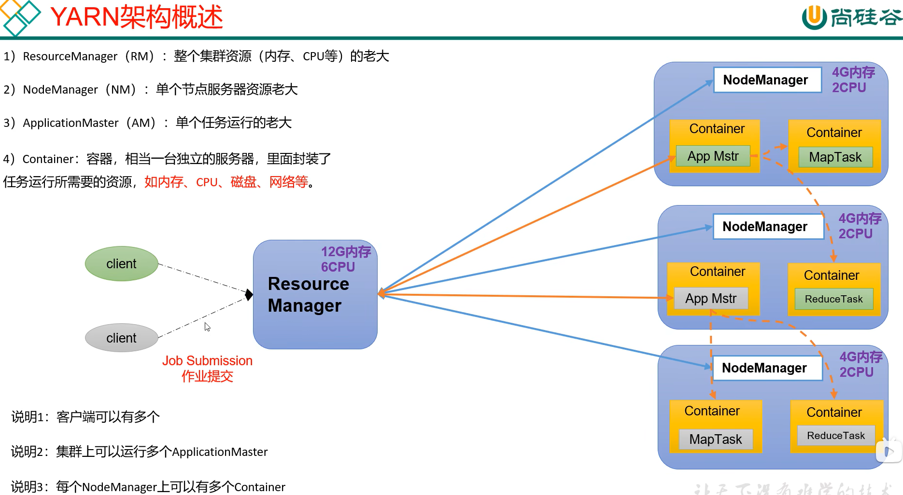
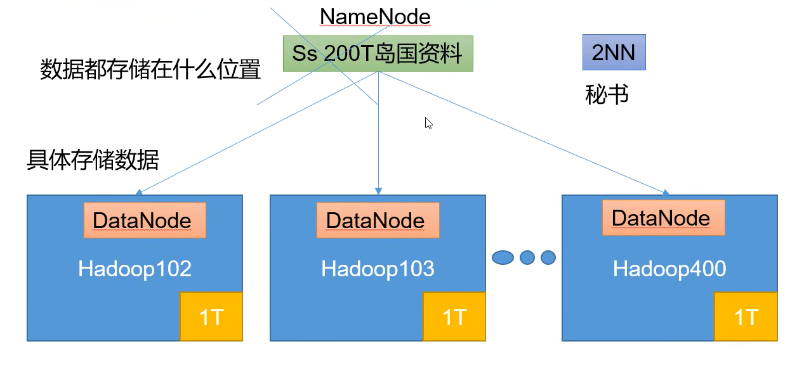
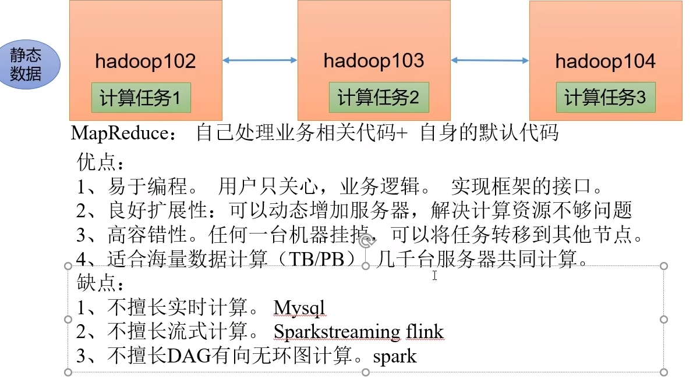

## hadoop主要解决的问题

大量数据的存储和计算

## hadoop是什么

分布式集群资源管理器

##### 广义上讲：

## hadoop的组成

## MapReduce架构

**map（分界）reduce（减少、归纳）**

## yarn架构

yarn是一个资源调度平台，负责为应用程序提供服务器资源，相当于一个分布式的操作系统平台。MapReduce等程序相当于操作系统平台上的应用程序。

## HDFS架构

## MapReduce

##### 优缺点

