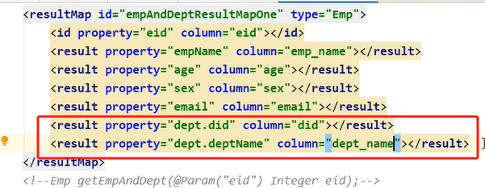
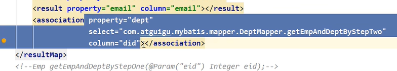
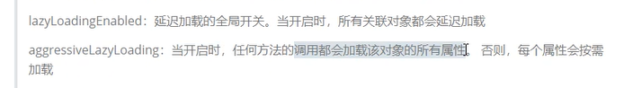
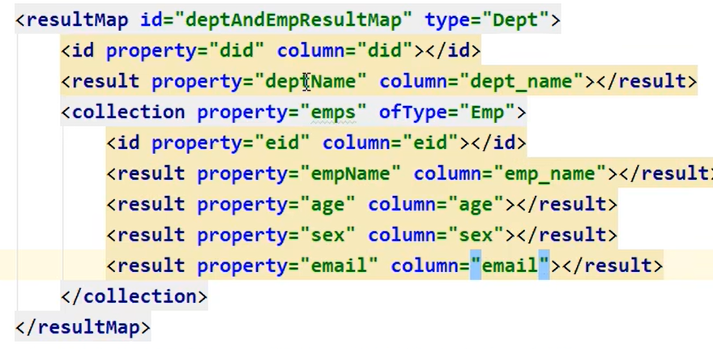
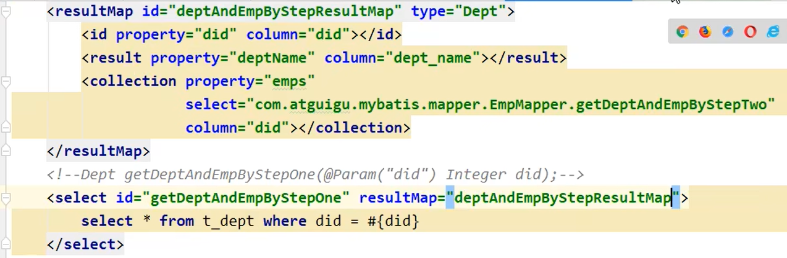

```
    configuration:
      map-underscore-to-camel-case: true
      lazy-loading-enabled: true
      aggressive-lazy-loading: false
```

# 一对一

级联



Association


分步查询




延迟加载



# 一对多

collection



分步查询

