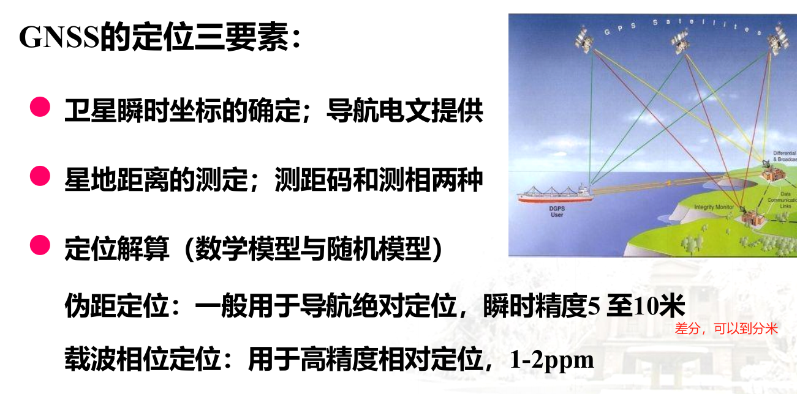
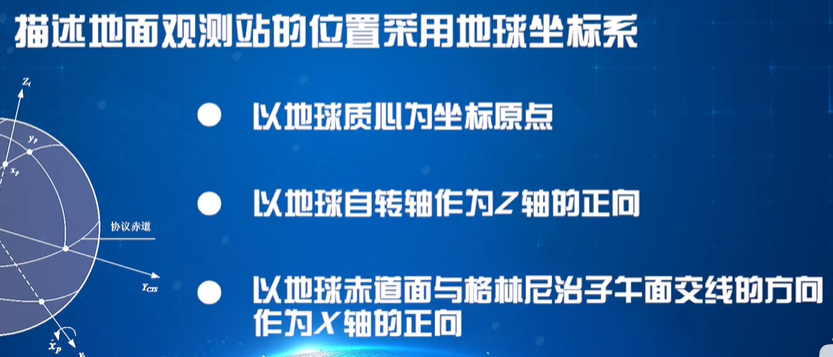
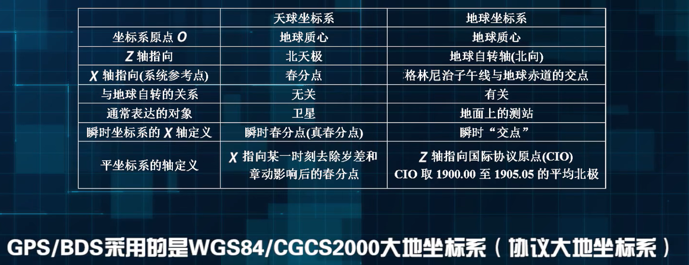

# 内容介绍

# 卫星大地测量

## 坐标系

### 理论

1. **极坐标系：**
   - 使用极径和极角两个参数来描述点的位置，极径表示点到原点的距离，极角表示点在极坐标系中的方向。
2. **球坐标系：**
   - 用来描述三维空间中的点的坐标系，由径向距离、极角和方位角三个参数来表示点的位置。
3. **地理坐标系（经纬度坐标系）：**
   - 用来描述地球表面上点的位置的坐标系，通常使用经度和纬度来表示点在地球表面上的位置。
4. **笛卡尔坐标系：**
   - 二维直角
   - 三维直角

### 应用

卫星定位中常采用空间直角坐标系及其相应的大地坐标系，一般取地球质心为坐标系的原点。根据坐标轴指向的不同，有两类坐标，天球坐标系和地球坐标系。

#### 天球坐标系

天球坐标系与地球自转无关，便于描述人造地球卫星的位置。

#### 地球坐标系

地球坐标系随同地球自转，可看作固定在地球上的坐标系，便于描述地面观测站的空间位置；

格林尼治子午线：0度线

## 时间系统

### 协调世界时UTC（Coordinated Universal Time）

### GPS、北斗时间

原子钟不跳秒

## 受摄运动

卫星在运动过程中受其他外力的影响

### 轨道根数

描述卫星轨道的相关参数

## 导航电文

导航电文的主要内容：轨道根数+ 变化率（卫星运动的）

### 广播星历

**星历** 卫星运动过程中经历的相关信息；

卫星广播的形式

### 精密星历

经过计算，一般通过卫星通信、互联网传播

#### IGS

国际组织，提供精密星历数据

## 导航电文的内容

## 计算卫星坐标的程序设计

### 历元

一个时间段 epoch

### **星历**：

- **定义**：星历是一组描述卫星轨道形状、大小和方向的参数集合。
- **参数**：包括卫星的半长轴、偏心率、轨道倾角、升交点经度等。
- **内容**：星历数据可以包括广播星历和精密星历两种类型，用于卫星导航系统中的定位和跟踪。
- **使用**：接收设备通过星历数据计算卫星的位置和速度信息，从而进行定位和导航计算。
- **更新**：星历数据会定期更新，以反映卫星在轨道上的实时位置和运动状态。

# 伪距观测与伪距定位

## 伪距定位

**伪距**（Pseudorange）是指从接收机到卫星的距离，但它包含了由于卫星和接收机时钟不同步而引入的误差。伪距是通过测量接收机接收到的信号时间戳与卫星发射信号时间戳之间的时间差，再乘以光速（约299,792,458米/秒）得到的。

## 载波相对定位

至少需要两个接收机，对比提高精度

**载波**（Carrier）是指卫星信号的高频载波。GNSS信号通常在L波段（1-2 GHz）传输，例如GPS的L1频段（1575.42 MHz）。

**载波相位**（Carrier Phase）是指接收机测量从卫星信号的某一时刻开始，累积的载波波长数和当前相位。由于载波频率高，波长短（例如L1频段的波长约为19厘米），其测量精度比伪距高得多。

**载波相位定位**的基本原理是：

1. **相位测量**：接收机连续跟踪并记录载波信号的相位变化。
2. **模糊度解算**：由于载波相位测量包含整周模糊度，必须解算这些整数周数。
3. **精确定位**：使用载波相位数据进行差分处理（RTK或PPP等），获得高精度定位结果。

## RTK定位

基于载波定位原理，进行实时定位

## 网络RTK

