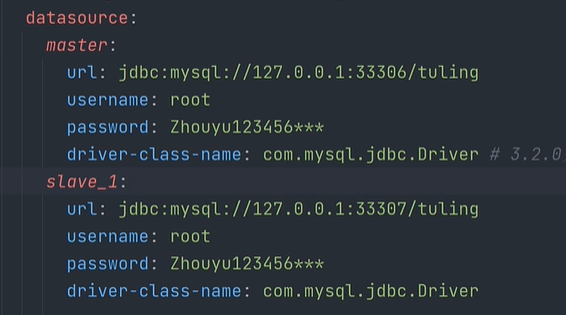
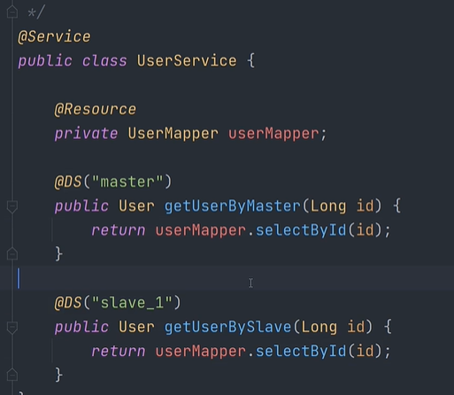
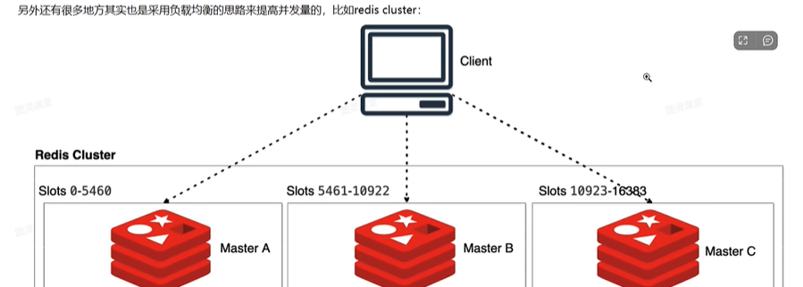
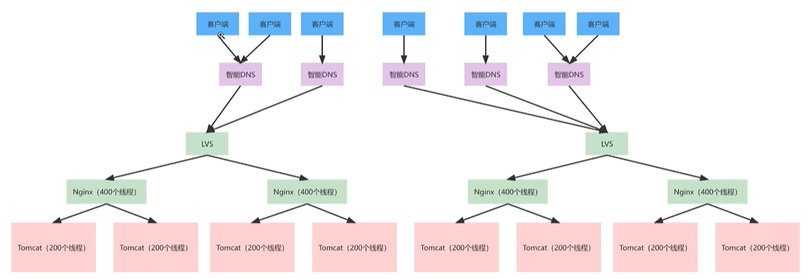

# 高性能

## 数据库

### 索引

#### 数据结构

hash、B+ tree

#### 最左前缀原则

如果一个索引包含列A、B、C，那么只有满足以下条件的查询才能充分利用这个索引：

1. 查询条件中使用了索引的最左侧的列，即列A；
2. 查询条件中使用了索引的连续的左侧列，即列A和B，或者列A、B和C。

如果查询条件中没有使用索引的最左侧列，那么数据库无法充分利用这个多列索引，可能会导致索引失效，从而降低查询性能。

#### 前缀索引

#### select *  覆盖索引  减少回表

#### order by   group by  使用索引        sort buffer

#### join小表驱动大表                    join buffer

### buffer pool

#### pege

数据、索引

### redo buffer

### 锁

锁的粒度要小

### 事务

尽早提交，使用小事务

### 读写分离 （写主，读从）

### 分库分表

水平垂直分库分表

ShardingSphere，主要通过配置文件

## jvm调优

### 监控 工具

### 升级jdk

### jvm 参数调整

## 缓存

### 本地缓存

#### list 、map、caffeine

### 非本地缓存

#### Redis

## 异步

### 消息队列

### 多线程

## 池化技术

### 连接池

### 线程池

### 内存池

## 硬件资源

### cup

### 内存

### 磁盘

### 带宽

# 高扩展

## 负载均衡

### 无状态微服务

### 算法

#### 平均加权

####  加权随机

#### 一致性hash      session

## 自动扩容

docker、k8s

# 高可用

## 集群

包含阈值（nacos）

## 限流

每秒请求数达到一定时触发，不走业务代码了

组件sentinel

## 熔断降级

异常达到一定数量触发，不走业务代码了

## 回滚

## 压测

## 链路跟踪、监控

