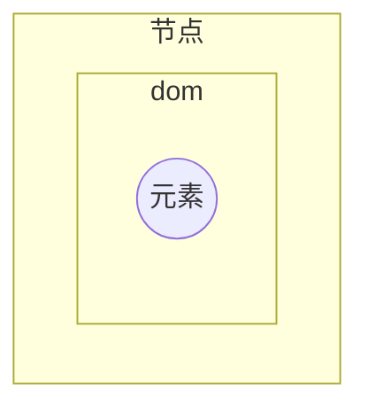

# 之前笔记本

 prompt（）

模板字符串

type of  123

函数中 arguments 伪数组

匿名函数

```javascript
let fn= function (){

}
```

立即执行函数

```javascript
(function (){})()
```


父函数

子函数

闭包

声明变量

var  、let、const


预解析

let  只声明，不初始化

动态参数  arguments

剩余参数   ...a


箭头函数

箭头函数 无 arguments， this指针也有问题

```javascript
let fn= function(){}
let fn= ()=>{}
// 只有一个参数 
let fn= a=>{}
// 只有一行代码
let fn= a=>a*a
```

解构赋值

数组

对象

```
let [a,b,c] =[1,2,3];
let [,...c] =[1,2,3];
```


== ：先进行类型转换

===： 不进行类型转换


2.24.0

2：大版本

24：功能版本

0：bug修复版本


package.json: 大版本

package-lock.json 小版本


express == springMvc

npm+webpack == maven

package.json == pom.xml


热部署  nodemon


协议，域名，端口，任何一个不同都是跨域


默认导入

按需导入

直接导入


schema://host:port/path?query#fragment

schema：协议

fragment：锚点（hash），类似目录索引


promise  异步

文本节点

文字节点

元素节点

属性节点




事件源、 事件类型、事件处理程序

冒泡

捕获

有些事件没有冒泡


事件委托

同步任务

异步任务


location、navigator、history


js 修改对象更容易

Java需要反射


子绝父相


