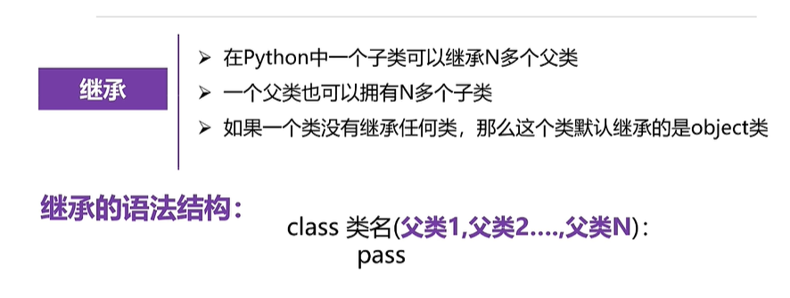
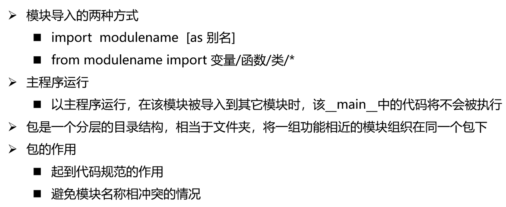
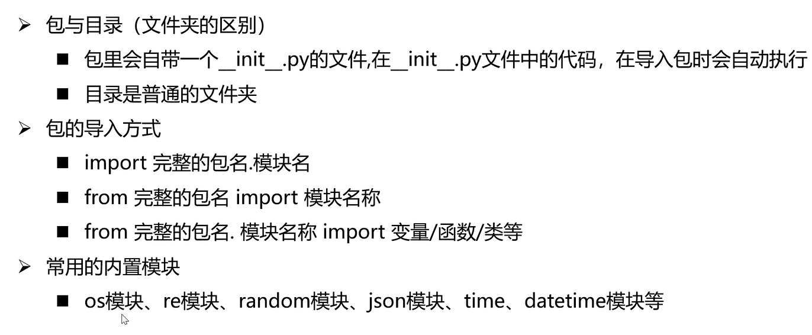
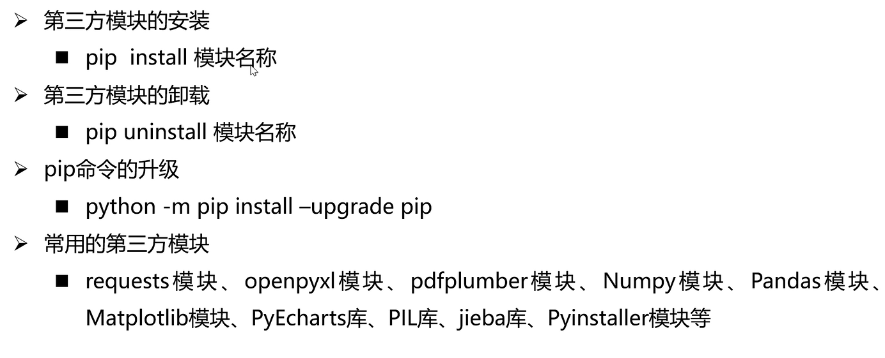
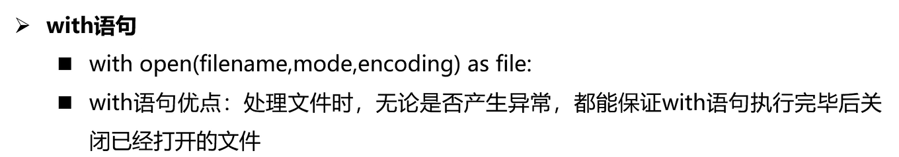

# 特点与定位

## 特点

1. Python是一个完全面向对象的语言，万物皆对象。
2. 数据值类型包括：整数、浮点、复数
3. 字符串包括：*  、in 、模板字符串、三引号多行字符串 ，解包赋值
4. del 删除一个变量
5. Python和C++一样 是多继承

## 定位

1. 数据处理
2. 快速解释运行
3. AI

## 问题

1. 不稳定的小数问题，如：0.1+0.2（其他语言也有）

## 数据类型

1. **整数（int）**：用于表示整数值，例如：`x = 10`
2. **浮点数（float）**：用于表示浮点数值，例如：`y = 3.14`
3. **复数（complex）**：用于表示复数，例如：`z = 2 + 3j`
4. **布尔值（bool）**：用于表示逻辑值True或False，例如：`is_true = True`
5. **字符串（str）**：用于表示文本数据，可以使用单引号或双引号表示，例如：`name = 'Alice'`


# o

# o

# o


# 序列

list、tuple、dist、set  这些更像是转类型

## 列表、list

[]

## 元组、tuple（数组）

()

## 字典、dist（map）

{}

## 集合、set

{}


# 字符串

# 异常

# 函数

def  f():

# 面向对象

## 继承



# 模块

Python中一个.py 文件就是一个模块







# 文件与IO



# 网络编程


# 进程与线程

## 进程

### 创建方式

1. 继承式
2. 函数式

#### 继承式

```python
from multiprocessing import Process
import multiprocessing

class MyProcess(Process):

    def run(self):
        print("this is MyProcess")
```


#### 函数式

```python
from multiprocessing import Process

import os,time
def my_run(name):
    print(f"p{os.getpid()}----{name}")
if __name__ == '__main__':
    a=66
    p1=Process(target=my_run,args=(a,),name='p1')
    p1.start()
    p2=Process(target=my_run,args=(a,),name='p1')
    p2.start()
    a=a-22;
    print("begin sleep")
    time.sleep(1)
    print(f"main -{os.getpid()}---end")
```


## 线程

### 创建方式

1. 继承式
2. 函数式
3. Java中是接口和继承

#### 继承式

```python
from threading import Thread
import os,threading
class MyThread(Thread):
    def run(self):
        print(f"myThread-----pid{os.getpid()}-------tid{threading.get_ident()}")
```


#### 函数式

```python
from threading import Thread
import threading
import os

def testThread():
    print(f"testThread---pid{os.getpid()}-----tid{threading.get_ident()}")

# if __name__ == '__main__':
print(f"begin main---pid{os.getpid()}-----tid{threading.get_ident()}")
t1=Thread(target=testThread)
t1.start()

print("end  main")

```


