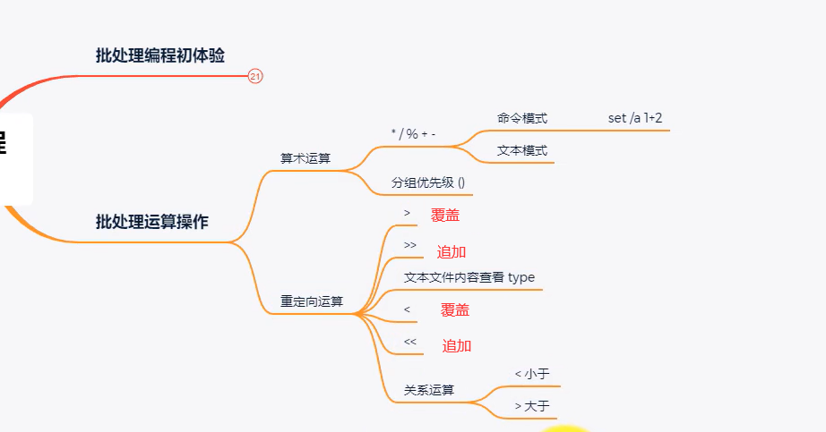
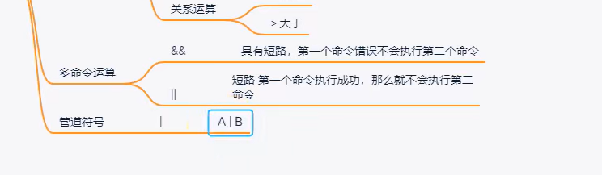
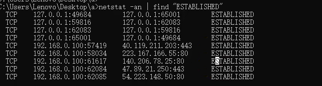
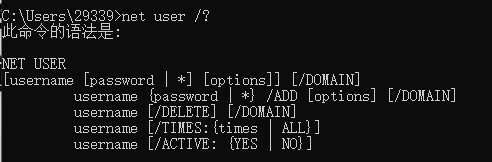
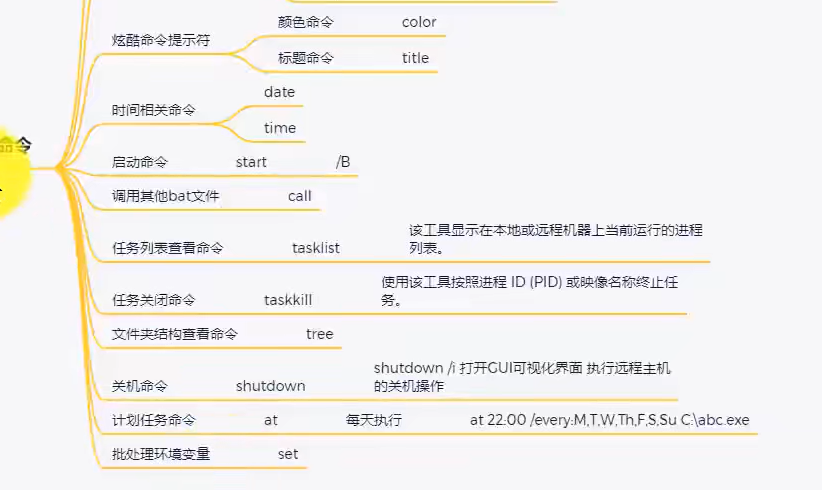
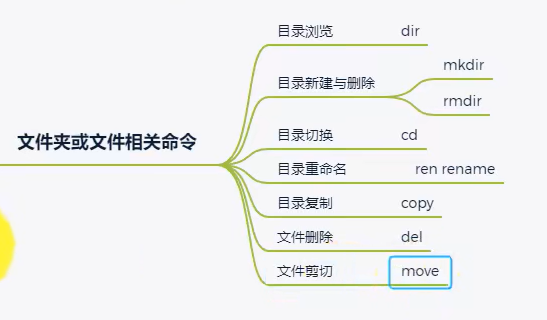
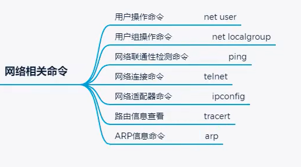
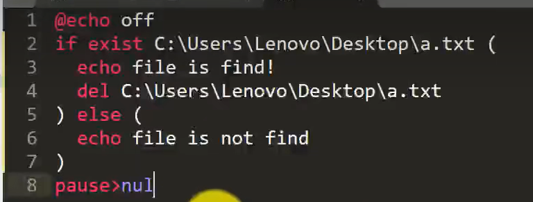
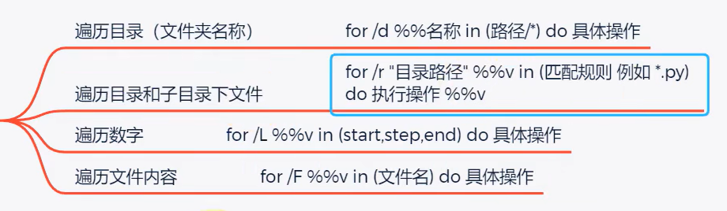
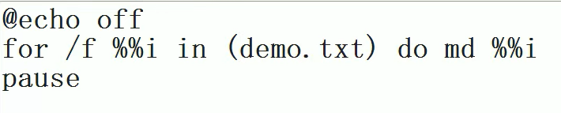

## 批处理运算

1. batch分为内部命令和外部命令
2. 使用 set 定义变量
3. 引用变量%变量名%
4. 在for命令中 cmd中需要% batch需要%%
5. 设置变量 `set a=10`，输出变量 `echo %a%`，设置变量表达式 `set /a b=%a%+1`
6. cmd中输入的参数用 %1 ，%2 接收，%0 是程序文件本身路径
7. 在if代码块中使用set赋值有问题，需要特殊设置

多命令运算和管道符号

## 批处理基本命令

### 命令格式

在命令语法中，方括号 `[]` 和花括号 `{}` 表示可选项和参数的语法元素。

- 方括号 `[]`：方括号内的内容是可选的，表示在使用命令时可以选择性地包含或省略这些选项或参数。例如，`[password | *]` 表示可以提供一个密码或使用 `*` 提示输入密码，但不是必需的。
- 花括号 `{}`：花括号内的内容表示可供选择的选项或参数。例如，`/ACTIVE:{YES | NO}` 表示可以选择将 `/ACTIVE` 选项设置为 `YES` 或 `NO`。

### 文件参数传递

## 文件相关命令

## 网络相关命令

## 条件判断结构

## 循环结构

## 其他笔记

https://www.cnblogs.com/CourserLi/p/15344685.html