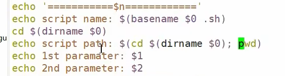

## shell脚本入门

字符串中输出$变量时，外面需要使用单引号

### 执行方式

1. sh 或 bash 执行脚本
2. 输入脚本的绝对路径或相对路径（需要具有文件的可执行权限+x)
3. source 或 . 执行  （该方式是在当前shell中执行，上面两种是开启一个新子shell中执行）

## 变量（环境变量）

1. 系统变量
2. 自定义变量
3. 全局变量 export 变量名  将局部变量升级为全局变量（而且修改值只在局部有效）
4. 局部变量

### 自定义变量

## 特殊变量

### $n

### $#

### $*  $@

### $?

## 运算符

命令替换

## 条件判断

**注意** [] 中要有空格

## 流程控制

### if判断

**注意**上面分号的使用

### case语句

### for 循环

**注意**双小括号中就可以写一些数学的比较

### while循环

let的使用可以使高级语言的语法特性

## 读取控制台输入

## 函数

命令替换$() 就是系统函数调用

### 系统函数

### 自定义函数

解决**return**

## 其他笔记

https://blog.csdn.net/da_ge_de_nv_ren/article/details/128391575

