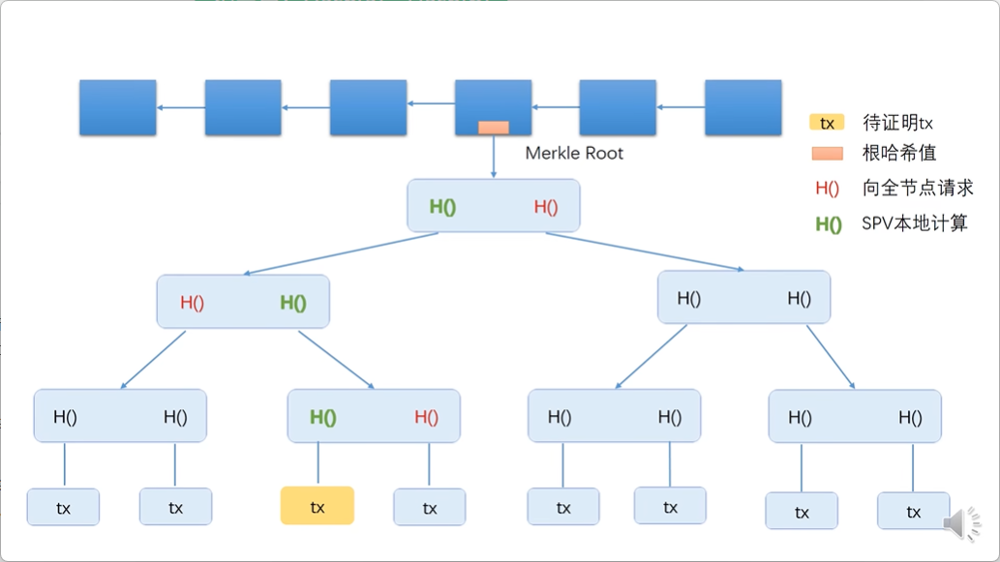
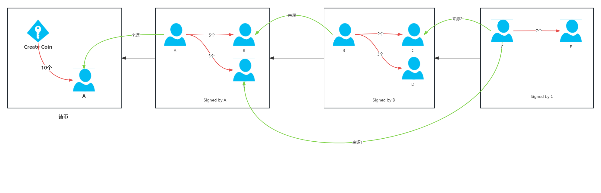
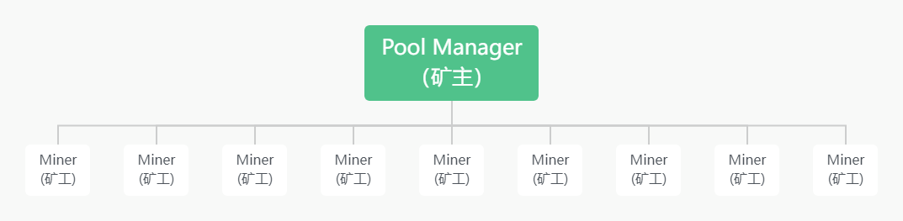

交易

打包记账

以谁为准：工作量证明

# 北京大学 区块链技术与应用 主要内容

https://www.yuque.com/tmfl/block_chain

密码学基础

比特币的数据结构

共识协议和系统实现

挖矿算法和难度调整

比特币脚本

软分叉和硬分叉

匿名和隐私包含

# 密码学基础

## 比特币的哈希性质

1. collision resistance  抗碰撞性
2. hiding    不可逆性
3. puzzle friendly   不可预测性

### puzzle friendly 

挖矿就是 将块头 block header 和一个随机数 nonce 进行hash计算，使其落在指定一个区间中

这个hash值 是不确定的

difficult to solve，but easy to verify

MD5是不安全的 可以认为确定 hash碰撞，比特币使用的是sha-256

### 账户的开户

日常生活中，开一个普通的银行账户，需要带着资料到银行去审批开户，这就是普通的“中心化”，银行就是那个“中心“。

而在“去中心化”的比特币中，开立一个账户无需经过审批，**只需要在本地创建一个公钥-私钥对，就是创建了一个账户**，这个公私钥对就是一个账户。这种公私钥的算法称为 asymmetric encryption algorithm（非对称加密算法）。

非对称加密时需要一个好的随机源。

# 比特币的数据结构

**hash pointers**：普通的指针是存储内存中的一个结构体起始位置，哈希指针除了要指向这个地址外，还要保存这个结构体的哈希值。

**区块链数据结构**：是以区块链（block chain）或链表（指针使用hash pointers）+ merkle tree 组成的，所使用的指针都是hash pointers；

每个hash pointers 是根据上一个区块计算出来得

每个block 包括 **block header和 block body**

在merkle tree中 根节点存储数据

# 共识协议

## 数字货币的问题

“双花”攻击（double spending attack）

## 比特币交易流程：

（红色线条表示转出，绿色线表示比特币的来源）

## 区块的组成

一个区块分为：block header 和 block body。

### block header

1. 比特币协议的版本号（version）
2. hash pointers（hash of previous block header）：
3. 整棵 merkle tree的根哈希（merkle root hash）
4. 挖矿的难度目标阈值（target）
5. 挖矿的随机数（nonce）

target中存储的就是目标阈值的编码(Bit），挖矿寻找一个随机数nonce，最终使得拼出来的整个区块头的哈希满足： 

### block body

有交易列表（transaction list）也就是merkle tree

### 节点

全节点（full node）保存区块链的所有信息，验证每个交易。所以也称为 fully validating node。

轻节点（light node）也叫 light weight node。一般情况下，轻节点无法独立验证交易的合法性。

系统中大部分的都是轻节点。只有全节点才会验证每次交易。

### 投票机制

任何投票机制都要首先确定谁有投票权，要有 membership。

如果一个区块链的membership是有严格定义的，不是随便一个节点都可以加入（例如**联盟链**hyperledger，只有符合某些条件的大公司才能加入）。这种情况下，投票机制是可行的。

#### 分布式理论

cap

#### 分布式共识协议

paxos、raft 、zab

# 系统实现

## BTC的具体实现

区块链是一个去中心化的账本。

比特币采用的是基于交易的账本（transaction-based ledger），每个区块里记录的交易信息（转账交易、铸币交易等），但是系统中并没有记录每个账户当前有多少个币，这个需要通过区块链中涉及该账户的交易来推算。

除了比特币的这种基于交易的账本模式，与之对应的还有基于账户的账本（account-based ledger），例如以太坊就是用的这种模式。在这种模式中，系统需要显式的记录每个账户中剩余多少个币。

## 挖矿的过程

挖矿就是不断的尝试各种nonce，来求解puzzle，每次尝试nonce可以看做一次 Bernoulli trial（伯努利试验，在同样的条件下重复地、相互独立地进行的一种随机试验，试验只有两种结果：发生或者不发生。例如投掷硬币就是伯努利试验）。

如果我们做很多的Bernoulli trial，每个试验结果都是随机的，这些Bernoulli trial就构成了一个 Bernoulli process（伯努利过程，伯努利实验的一个序列）。

## 安全性

### 分叉攻击

# BTC网络

## 比特币网络原理

 

比特币工作在应用层，它的底层是一个P2P Overlay Network。

| 网络层级          | 协议                |
| ----------------- | ------------------- |
| Application Layer | BitCoin Block chain |
| Network Layer     | P2P Overlay Network |

比特币的P2P网络中，所有节点都是对等的。而其他的P2P网络中可能会存在超级节点（super node）、主节点（master node）。

如果要加入这个网络，至少需要一个种子节点（seed node），这个种子节点会告诉你它知道的其他节点，节点之间通过TCP通信，这样有利于穿透防火墙。离开时不需要通知其他节点，只需要退出应用程序即可，别的节点没有监听到你的消息，过一段时间就会把你删掉。

**比特币系统中，每个节点要维护一个等待上链的交易的集合**。节点第一次听到这个交易时，将这个交易写入这个集合中，并转发给邻居节点。转发的前提是这个交易是合法的：有合法的签名、以前没有被花过。

# BTC挖矿难度

## 调整挖矿难度的意义

默认10分钟出一个区块，如果难度不变，随着总算力的增加，出块时间会减少；

出块时间减少，增加链的分叉，降低诚信节点的算力，减少安全性；

## 难度的调整

会根据出块时间做调整，使其保持在10分钟

**总算力的增加，难度的增加，说明热度增加，币价也会增加；**

# BTC挖矿

## 比特币系统节点

 

比特币系统中存在两种节点，一种是全节点，一种是轻节点。

全节点特点：

●一直在线

●在本地硬盘上维护完整的区块链信息

●在内存里维护UTXO集合，以便快速检验交易的正确性

●监听比特币网络上的交易信息，验证每个交易的合法性

●决定哪些交易会被打包到区块里

●监听别的矿工挖出来的区块，验证其合法性

●挖矿 

○决定沿着哪条链挖下去

○当出现等长的分叉的时候，选择哪一个分叉

轻节点（SPV client）特点：

●不是一直在线

●不用保存整个区块链，只要保存每个区块的块头

●不用保存全部交易，只保存与自己相关的交易

●无法校验大多数交易的合法性，只能检验与自己相关的那些交易的合法性

●无法检测网上发布的区块的正确性

●可以验证挖矿的难度

●只能检测哪个是最长链，不知道哪个是最长合法链（因为没法检测这条链上的交易都是合法的。轻节点会假设矿工都会沿着合法的最长链挖下去）

比特币网络中大部分节点都是轻节点。如果只需要进行转账等交易，而不进行挖矿，那么只需要运行一个轻节点即可。

## 挖矿的设备

### CPU

会有很多资源闲置

### GPU

GPU设计的是用来做通用并行计算，会有一些资源闲置

### ASIC

ASIC（Application Specific Integrated Circuit，专用集成电路）,专门负责求解 mining puzzle ，配合矿池使用。

## 矿池

矿池，就是把这些矿工组织起立，作为一个整体。

矿工们只负责计算哈希，全节点的其他功能都由矿主负责。（ASIC芯片只能负责计算哈希值，不能处理全节点的其他功能）。

### 矿池的架构

矿池的架构一般是：一个全节点，驱动很多矿机。

# BTC脚本

这种语音没有循环，对加密算法有很好的支持

# 分叉

## 硬分叉

老节点不认可新节点，认为新节点的区块是非法的。

全部的节点更新才能解决分叉问题。

从挖矿角度，**对老节点有利**。

## 软分叉

新节点不认可老节点，认为老节点的区块是非法的。

51%的节点更新可以解决分叉问题。

从挖矿角度，**对新节点有利。**

# 问答

比特币中的收款地址是收款人的公钥地址取hash

# 匿名性

## 盲签

盲签方法：

- 用户A生成一个流水号SerialNum，银行在不知道SerialNum的情况下返回签名Token，减少A的存款

- 用户A把SerialNum和Token交给B完成交易

- 用户B拿着SerialNum和Token给银行验证，银行验证通过，增加B的存款

- 银行无法把A和B联系起来

# 思考

## hash指针

区块链的节点如何找到前一个节点在内存中的位置：

**全节点会将区块链上的这些区块存储在一个`(key,value)`数据库里**，其中`key`就是这个区块的区块头哈希，`value`就是这个区块的具体内容。

一个常用的`(key,value)`数据库就=是levelDB。

## 多重签名

## 比特币的稀缺性

**一个好的货币并不需要确定的总量，甚至需要一定的通胀性**，这样有利于货币的流通，经济的发展。

## 量子计算

传言中，量子计算机的算力非常强大，可以破解现有的各种加密算法。

但是量子计算机离实际使用还有相当长的一段时间，在比特币的整个生命周期中可能都无法遇到量子计算机的威胁。

## 远程控制卡

