## scala入门

#### 面向过程

架构、结构简单，程序的执行效率高

#### 面向对象

功能分离、可维护性强、耦合度低

#### 特点

1. 更适合操作数据
2. scala 中可以使用符号定义变量、方法、等名称
3. 没有continue和break，分别采用循环守卫和抛出异常进行
4. 方法里面可以定义函数

## 变量和数据类型

#### 变量和常量

|      |      |
| ---- | ---- |
| var  | 变量 |
| val  | 常量 |
|      |      |

#### 字符串

模板字符串

三引号  多行字符串

#### 数据类型

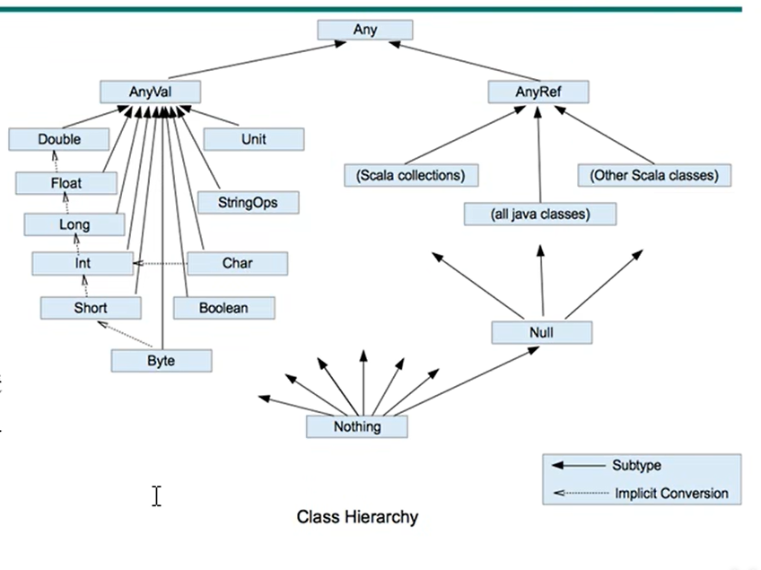

#### Unit、Null、Nothing

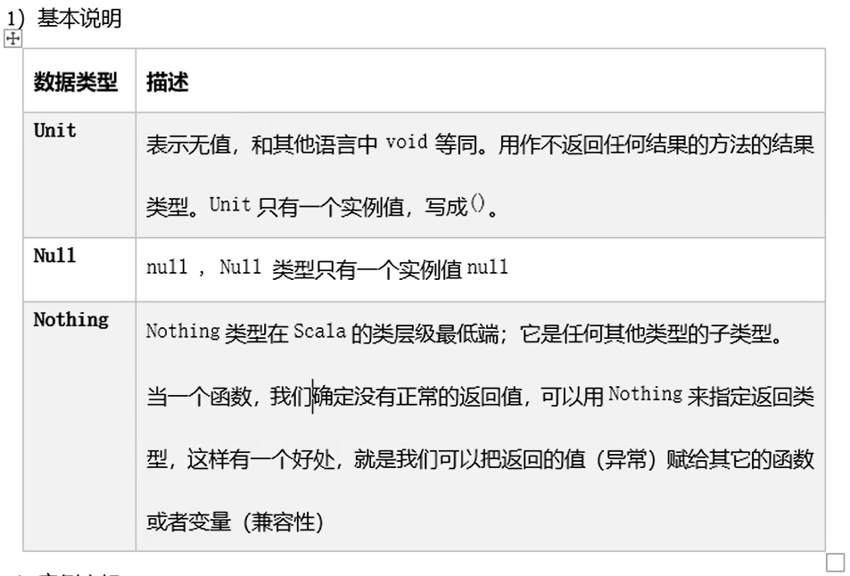

## 运算符

#### 比较运算符

==在String判断时与Java中不同

==是判断内容与equals一样，eq判断地址

==为Java中的equals

#### 赋值运算符

scala中没有++、--

## 流程控制

#### if    else

允许有返回值

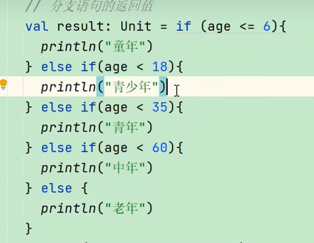

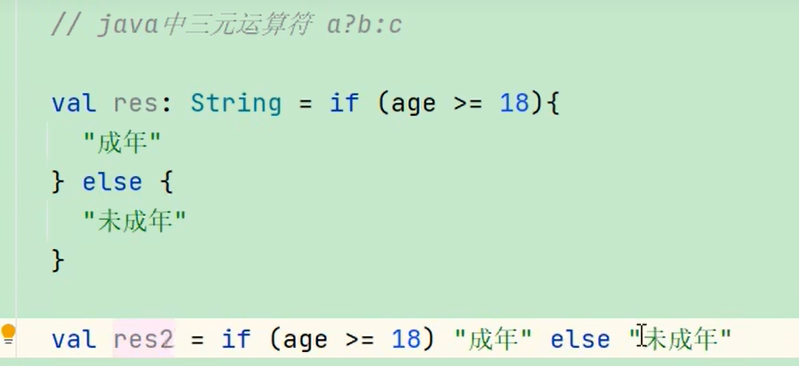

#### for循环

包含10

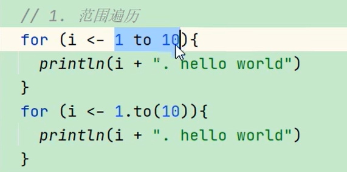

不包含10

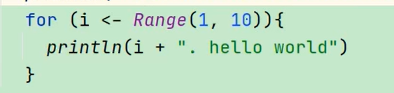

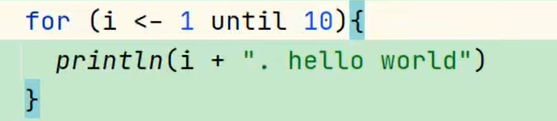

Range相当于一个数组，所以也可以这么写

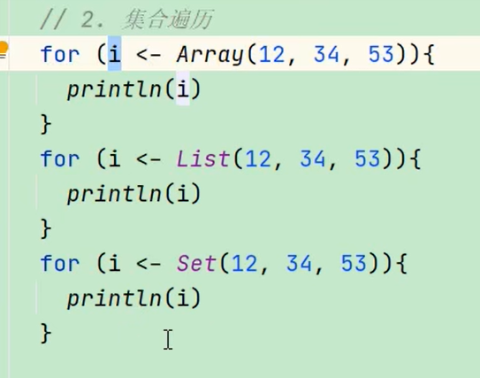

#### 循环守卫

scala中没有continue

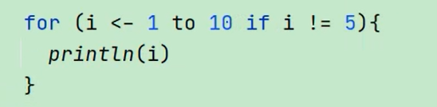

步长

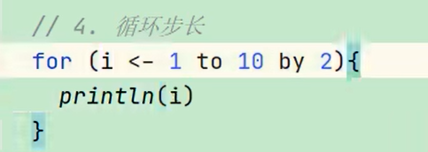

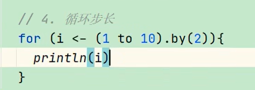

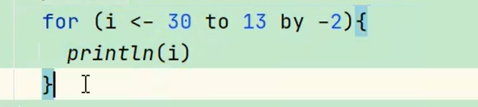

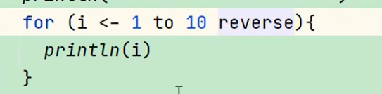

嵌套循环

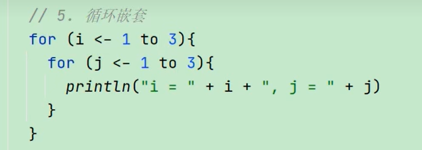

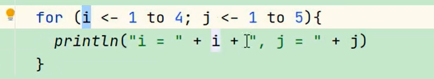

99乘法口诀

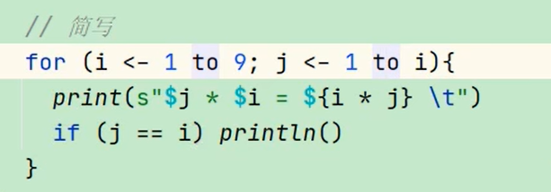

循环引入变量

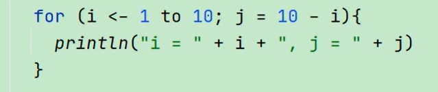

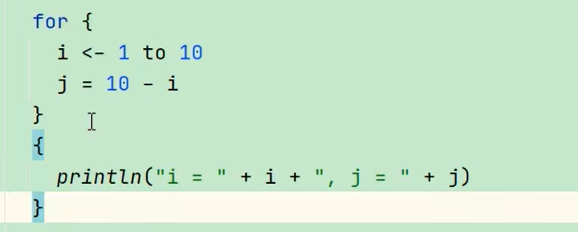

九层妖塔

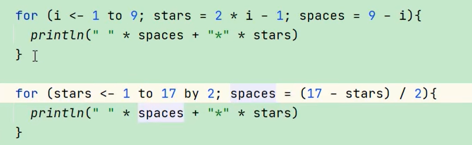

循环返回值

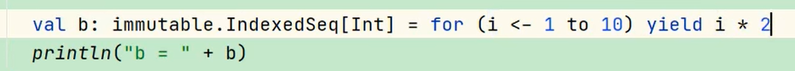

#### while循环(不推荐使用)

#### 循环中断

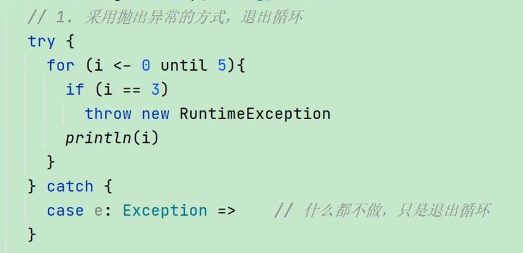

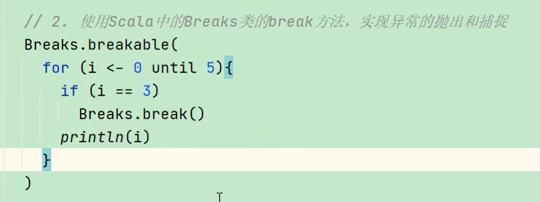

## 函数式编程

y=f（x）；

#### 函数基本语法

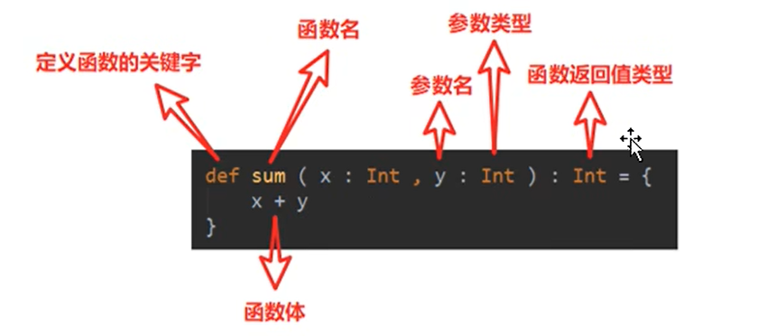

#### 函数参数

参数默认值

带名参数

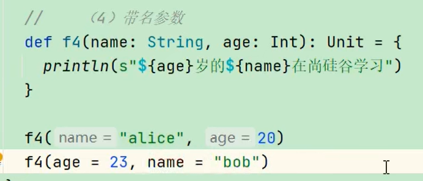

#### 函数至简原则

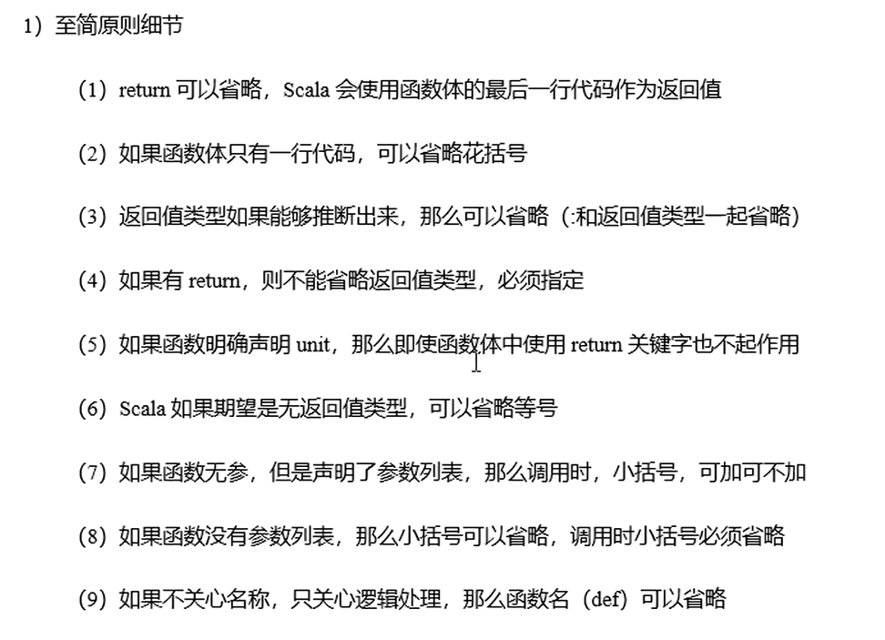

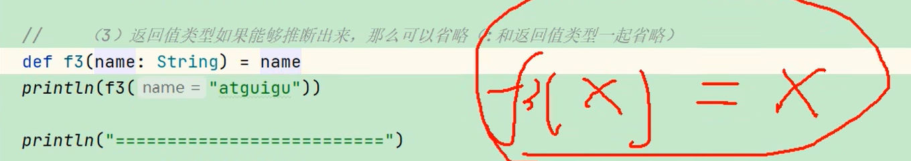

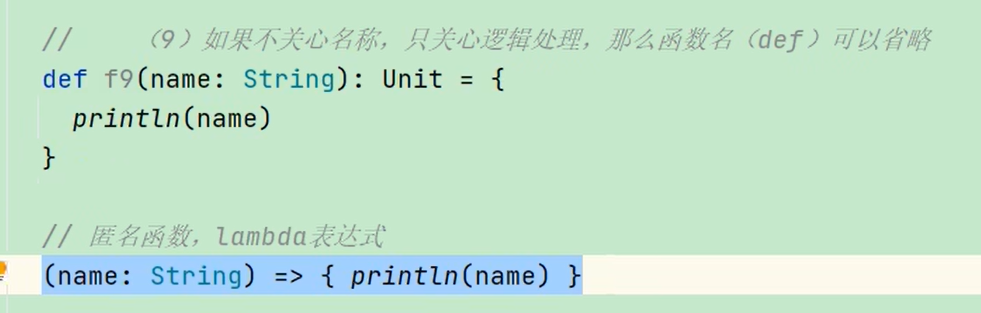

#### 匿名函数

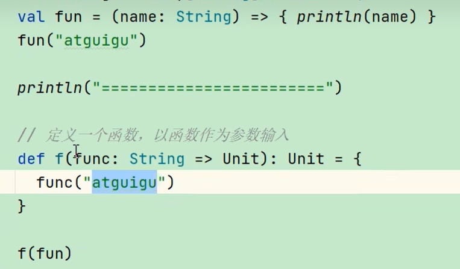

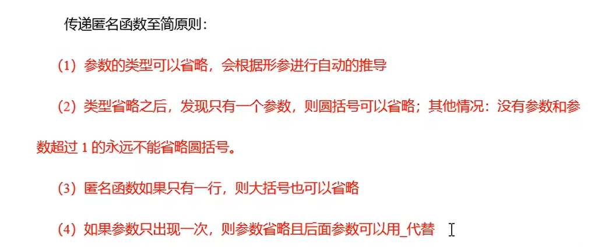

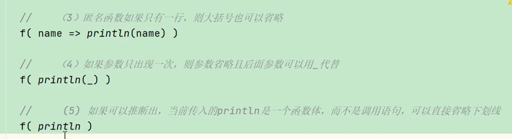

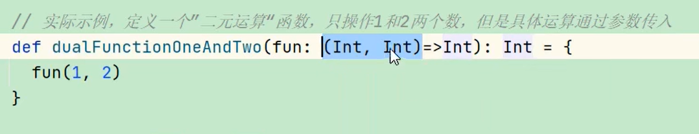

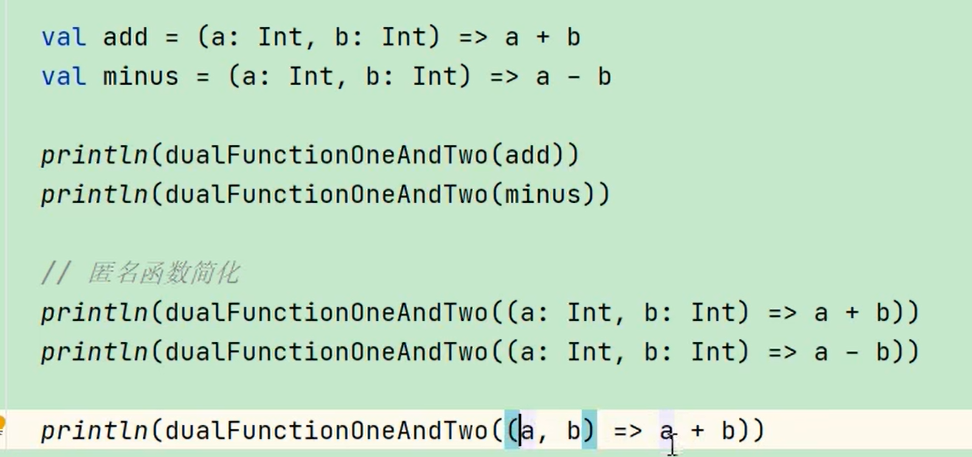

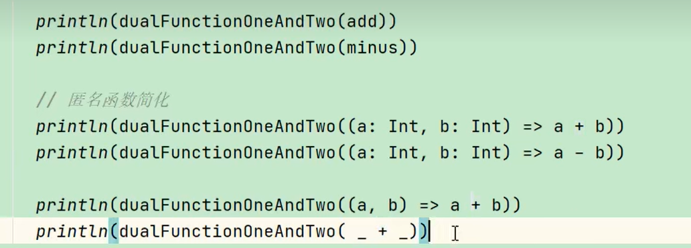

#### 高阶函数

函数可以作为值传递

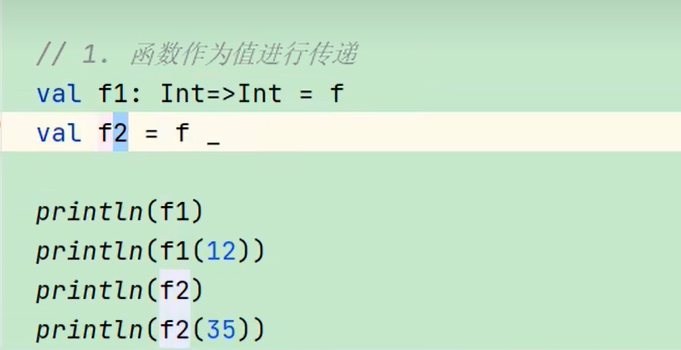

## 面向对象

### scala包

#### 包对象

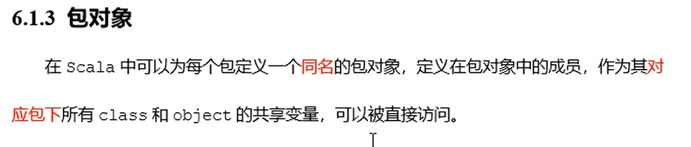

### 封装

#### 访问权限

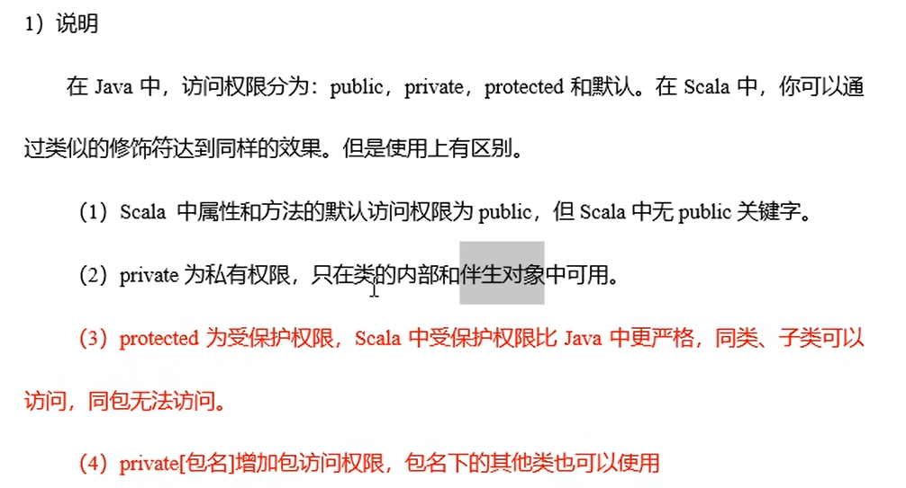